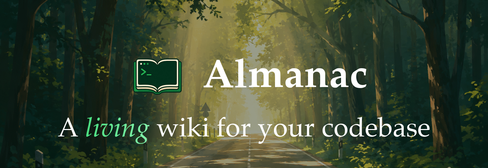

<p align="center">
  
</p>

<p align="center">
  <a href="https://pypi.org/project/codealmanac/"></a>
  <a href="https://pepy.tech/projects/codealmanac"></a>
  <a href="https://github.com/AlmanacCode/codealmanac"></a>
  <a href="https://discord.com/invite/jjuxtrGvJ"></a>
  <a href="https://www.linkedin.com/company/codealmanac/"></a>
  <a href="https://www.ycombinator.com"></a>
  <a href="./LICENSE.md"></a>
</p>

# CodeAlmanac

A living wiki for your codebase, maintained by AI coding agents.

CodeAlmanac gives AI agents the context code alone cannot hold: why a system is
shaped the way it is, what broke before, which invariants matter, and how
workflows cross files and services. The wiki is plain markdown in your repo,
indexed locally, and reviewed in Git like any other code change.

**Supported today:** macOS with Codex or Claude Code. Requires Python 3.12+.

## Quickstart

Give this prompt to your coding agent:

```text
Install and set up CodeAlmanac for this repository.

Use the official installer:
curl -fsSL https://codealmanac.com/install.sh | sh

Then run `codealmanac setup` without `--yes`. Walk me through its interactive
setup and wait for my choices instead of selecting defaults for me.

Initialize this repository if it does not already have an almanac/ directory,
then verify the installation with `codealmanac doctor`.
```

Prefer to do it yourself?

```bash
curl -fsSL https://codealmanac.com/install.sh | sh && codealmanac setup
```

See [Install](#install) and [Setup](#setup) for more options.

Once CodeAlmanac is set up:

```bash
cd your-repo
codealmanac init                     # Makes your wiki, if you don't have one
codealmanac search "getting started" # Shows matching wiki pages.
codealmanac show getting-started     # Opens one page in the terminal
codealmanac serve                    # Shows the wiki in local web viewer.
```

## Install

With the install script:

```bash
curl -fsSL https://codealmanac.com/install.sh | sh
```

or directly:

```bash
uv tool install codealmanac@latest
```

or:

```bash
python -m pip install codealmanac
```

From this checkout:

```bash
uv sync
uv run codealmanac --help
```

`codealmanac` is the canonical command. Every install also provides `ca` as its
short alias, so `ca search "getting started"` is equivalent to the longer form.

Requires Python 3.12+.

## Migrating From The npm CLI

The legacy `codealmanac` npm package is retired. PyPI is the only supported
distribution. If you used the npm CLI, your machine may still carry the old
global install plus the hooks and agent instructions it set up. Remove those
before installing from PyPI.

The easiest path is to hand this prompt to your coding agent:

```text
Migrate this machine from the old codealmanac npm CLI to the new PyPI CLI.

1. Uninstall every old install of the CLI and its dependencies:
   npm uninstall -g codealmanac
   Also check bun, pnpm, and yarn global installs, and remove any stray
   codealmanac, almanac, or alm binaries left on PATH.
2. Remove everything the old CLI installed into agent tooling:
   - Delete codealmanac hooks from Claude Code settings
     (~/.claude/settings.json and any project .claude/settings*.json).
   - Remove codealmanac sections and @-imports from ~/.claude/CLAUDE.md and
     any other agent instruction files.
3. Install the latest PyPI CLI:
   curl -fsSL https://codealmanac.com/install.sh | sh
4. Run codealmanac setup --yes to reinstall agent instructions and automation.
5. Verify the migration:
   which codealmanac points at the new install and codealmanac --help runs.

Leave repo-local almanac/ wiki trees alone - they are committed wiki content,
not part of the CLI install.
```

## Setup

Install global agent instructions for the local tools you use:

```bash
# Interactive setup
codealmanac setup

# Quick install with recommended defaults; uses Codex as the AI runner
codealmanac setup --yes

# Quick install using Claude as the AI runner
codealmanac setup --yes --runner claude
```

Setup installs agent instructions for your chosen tools and three local macOS
`launchd` jobs. Nothing runs in the cloud.

| Job | Default schedule | What it does |
| --- | ---: | --- |
| Sync | Every 5 hours | Scans recent Codex and Claude conversations and queues useful knowledge for the relevant registered wiki. |
| Garden | Every 4 hours | Reviews every registered wiki for stale, duplicated, or poorly connected knowledge. |
| Update | Every 24 hours | Checks for and installs CodeAlmanac CLI updates when it is safe to do so. |

These schedules run locally in the background. Use
`codealmanac automation status` to see what is installed.

If you don't have Codex or prefer Claude, use `--runner claude`.

`--target` only chooses which global agent instruction files to install; it does
not choose the AI runner:

```bash
codealmanac setup --yes --target codex
codealmanac setup --yes --target claude
```

Customize automatic work during setup:

```bash
# Change how often recent agent conversations are scanned
codealmanac setup --yes --sync-every 5h

# Do not install automatic transcript sync
codealmanac setup --yes --sync-off

# Do not install automatic wiki cleanup
codealmanac setup --yes --garden-off

# Do not install automatic CodeAlmanac updates
codealmanac setup --yes --no-auto-update
```

To uninstall CodeAlmanac-owned local artifacts:

```bash
codealmanac uninstall --yes
```

## Daily Read Surface

Agents and humans use the same local read commands:

```bash
codealmanac search "checkout timeout"
codealmanac search --mentions src/checkout/
codealmanac show checkout-flow
codealmanac topics
codealmanac health
codealmanac validate
```

Use `--wiki <name>` to read another registered local wiki. By default,
commands target the exact current directory when it is a registered repository
root.

## Updating The Wiki

Lifecycle commands run one of three explicit agents—build, ingest, or garden—
through the public [Yoke SDK](https://github.com/AlmanacCode/Yoke). The existing
packaged prompt files remain the complete task instructions and direct agents
to edit the wiki under `almanac/`.

Lifecycle agents are trusted local coding agents. They run with the same broad,
non-interactive filesystem permissions CodeAlmanac historically provided, so
the `almanac/` boundary is an instruction and commit policy, not an OS sandbox.
Run lifecycle commands only in repositories where you accept that trust model,
and review the resulting Git diff when automatic commits are disabled.

```bash
codealmanac ingest README.md --using codex
codealmanac ingest github:pr:123 --using claude
codealmanac garden --using codex
```

`ingest` folds selected local material into the wiki. Inputs can include files,
directories, Git diffs, commit ranges, GitHub PRs or issues, URLs, and local
agent transcripts.

`garden` improves the existing wiki graph: stale pages, links, topics, weak
leads, duplicate pages, and unsupported claims.

No-op is valid. If the material adds no durable wiki knowledge, the harness
should leave the wiki unchanged.

`ingest` and `garden` create queued runs and start a local worker. Use
`codealmanac jobs` and `codealmanac jobs attach <run-id>` to follow them.

## Sync And Automation

CodeAlmanac can keep registered wikis current without requiring you to remember
maintenance commands.

**Sync** scans local Codex and Claude transcript stores for conversations active
since the previous completed sync. Conversations associated with registered
repositories are queued as ordinary ingest jobs. Sync may decide that a
conversation contains no durable knowledge and leave the wiki unchanged.

**Garden** periodically queues a maintenance job for each registered wiki. It
improves stale pages, weak links, topics, duplicated knowledge, and graph
structure.

**Update** keeps the locally installed CodeAlmanac CLI current. Scheduled
updates are skipped when an update would be unsafe, such as while lifecycle
work is active.

Automation is implemented with local macOS `launchd` jobs, not a hosted service
or cloud sync. Logs are stored under `~/.codealmanac/logs/`.

```bash
# See installed schedules
codealmanac automation status

# Change a schedule
codealmanac config set automation.sync.every 5h
codealmanac config set automation.garden.every 4h
codealmanac config set automation.update.every 24h

# Disable or re-enable a schedule
codealmanac config set automation.sync.enabled false
codealmanac config set automation.sync.enabled true
```

`config set` updates the user TOML and immediately makes launchd match. If you
edit the TOML directly, run `codealmanac config apply` afterward.

Automation creates individual background runs. Inspect those runs separately
with `codealmanac jobs`.

## Jobs

Lifecycle runs are recorded under `~/.codealmanac/`. Use these commands to
inspect and control them:

```bash
# List recent jobs with their IDs, kinds, statuses, and elapsed times
codealmanac jobs

# Show one job's status, summary, page changes, timestamps, and error details
codealmanac jobs show <run-id>

# Print the events recorded so far, including progress, tool activity, and errors
codealmanac jobs logs <run-id>

# Follow new events live until the job finishes, fails, or is marked cancelled
codealmanac jobs attach <run-id>

# Prevent a queued job from starting, or stop a running job and its agent
codealmanac jobs cancel <run-id>
```

`show` is a summary of the job; `logs` is a snapshot of its event history;
`attach` keeps watching and prints events as they arrive. All of these commands
read the same durable local job record, so they still work after the terminal
that started the job has closed. Add `--json` when consuming their output from
a script.

## Providers

CodeAlmanac uses `almanac-yoke` as its single provider boundary. Codex runs
through app-server; Claude uses Yoke's default Claude surface (currently the
Python Agent SDK). Existing Codex or Claude Code OAuth sessions are reused, and
API credentials can be supplied through Yoke when embedding the SDK.

Build, ingest, and garden are packaged as a Yoke agent collection under
`src/codealmanac/agents/`. Each agent uses Yoke's native folder contract:
`agent.yaml` describes tools and permissions, while `instructions.md` contains
the durable agent instructions. A lifecycle run passes only its typed runtime
context as the task prompt. Optional Yoke `skills/`, `subagents/`, and
`workflows/` folders can be added to an agent when the product needs them;
native Claude or Codex execution still decides how and when to use them.

```bash
codex login
claude auth login
codealmanac doctor
```

Read commands do not need provider credentials. Write-capable lifecycle
commands need the selected harness to be available and authenticated.

## What Gets Created By Init

With the default root:

```text
your-repo/
|-- almanac/
|   |-- README.md
|   |-- topics.yaml
|   |-- architecture/
|   |   |-- README.md
|   |   `-- indexer.md
|   |-- decisions/
|   |   `-- local-first.md
|   `-- guides/
|       `-- setup.md
|-- src/
`-- ...
```

Markdown pages live directly under `almanac/` in meaningful folders.
`topics.yaml` organizes pages across folders. `README.md` files act as landing
pages for their folder routes.

For auto-detection, a repository counts as a CodeAlmanac wiki when
`almanac/topics.yaml` and `almanac/README.md` exist.

## Runtime State

Derived local state lives under `~/.codealmanac/`:

```text
~/.codealmanac/codealmanac.db
~/.codealmanac/repos/<repo-id>/index.db
```

The local database records repositories, runs, run events, worker locks, and
sync state. Per-repository runtime files contain derived indexes. They do not
belong in the committed `almanac/` tree.

## Configuration

User config lives at:

```text
~/.codealmanac/config.toml
```

The supported defaults are:

```toml
auto_commit = true

[harness]
default = "codex"
model = "gpt-5.5"

[automation.sync]
enabled = true
every = "5h"

[automation.garden]
enabled = true
every = "4h"

[automation.update]
enabled = true
every = "24h"
```

CLI flags still win over config.

Use `codealmanac config set <key> <value>` for normal changes. It applies
automation changes to launchd immediately. Direct file edits are supported but
must be followed by:

```bash
codealmanac config apply
```

`auto_commit` means lifecycle prompts may tell the selected agent to use normal
Git commands for wiki source changes. CodeAlmanac does not stage files, split
diffs, or commit internally.

```bash
codealmanac setup --no-auto-commit
codealmanac config set auto_commit false
codealmanac config set auto_commit true
```

## Local Viewer

```bash
codealmanac serve
```

The viewer is read-only. It renders pages, search, topics, backlinks, and
file-reference navigation from local wiki data. By default it can switch across
available registered local wikis. Use `codealmanac serve --wiki <name>` to
narrow the viewer to one wiki.

## Troubleshooting

### `harness codex failed with status failed: Error: spawn ... codex ENOENT`

The Codex CLI on this machine is broken or missing: the `@openai/codex`
package is installed but its native binary is gone (a common result of an
interrupted install or a Node version switch under nvm/volta/fnm). Verify
with:

```bash
codex --version
```

If that fails with the same `spawn ... ENOENT`, reinstall the Codex CLI:

```bash
npm install -g @openai/codex
codex --version       # confirm the binary runs
codex login status    # confirm you are still signed in
```

Reinstalling does not sign you out: codex keeps its login under `~/.codex`,
outside the npm package.

Or switch CodeAlmanac to the Claude harness instead:

```bash
codealmanac config set harness.default claude
```

The same applies to `harness claude failed` errors: check
`claude --version`, reinstall the Claude Code CLI if broken, or switch the
default harness. `codealmanac doctor` reports harness availability.

## Current Contract

This rewrite is local-only for now.

- Public command: `codealmanac`
- Short alias: `ca`
- Repo wiki root: `almanac/` only
- Alternate repo wiki roots: none
- User state root: `~/.codealmanac/`
- Runtime: Python 3.12+
- Storage: local markdown plus derived state under `~/.codealmanac/`
- No hosted login/connect/upload commands.
- No public SDK or MCP package.
- No legacy compatibility aliases beyond the supported `ca` shorthand.
- No alternate wiki roots.
- No hidden cloud write path.
- No second canonical product name.

This is the Python/PyPI product surface. Hosted integration can be added later
around the same repo-owned wiki artifact, but it is not part of this release
surface.
