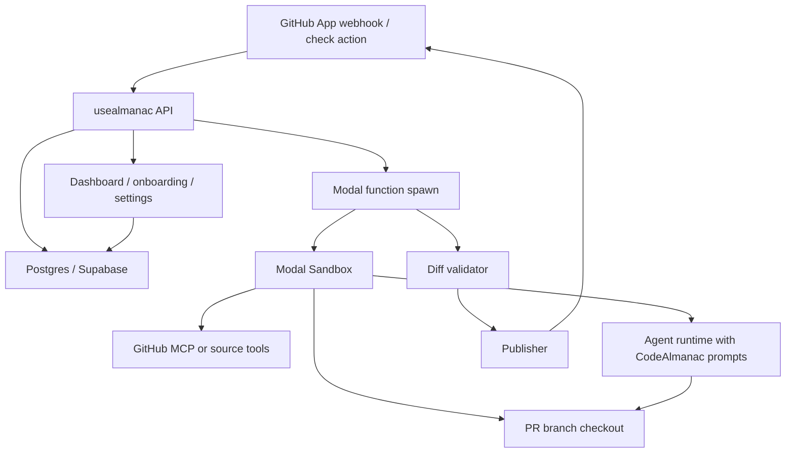

# Hosted GitHub App Architecture

Date: 2026-06-02

This note captures the current product and architecture direction for the hosted Almanac GitHub App. It is a design discussion artifact, not an implementation plan.

## Product Boundary

The hosted product is Almanac for GitHub. It installs as a GitHub App, watches pull requests, and helps keep the repository's Almanac current. User-facing copy should use "Almanac" and "Update the Almanac"; it should avoid "memory" language.

The first same-repository PR interaction is permission-first:

```text
Update the Almanac?

Almanac can keep this PR's Almanac up to date as the code and review discussion change.

[Update this PR] [Skip this PR] [Always update in this repo]
```

`Update this PR` grants ongoing approval for the current PR: Almanac may rerun as commits, comments, or review discussion change until the PR is merged, closed, or skipped. `Skip this PR` leaves the branch unchanged and stops future prompts/runs for that PR unless the user re-enables Almanac. `Always update in this repo` promotes the behavior to a repository default for future same-repository PRs.

For fork PRs, the first interaction is post-merge oriented:

```text
Update the Almanac after merge?

After this PR merges, Almanac can open a follow-up PR with any Almanac updates.

[Update after merge] [Skip this PR] [Always do this for fork PRs]
```

## Canonical Store

The repository remains the canonical store for Almanac pages. Hosted state can cache, index, queue, and display work, but durable Almanac content is Git-backed markdown under the repository's configured Almanac root.

The Almanac root must be configurable. Examples:

```text
.almanac/
docs/almanac/
```

Before publishing a commit, the hosted publisher must validate that every changed file is under the configured Almanac root. The agent may read the entire repository and inspect GitHub PR context through tools, but App-authored commits for "Update this PR" should not modify application code.

## High-Level Runtime



The web/API layer should return quickly. Long-running Almanac work should run through Modal's async job path. Modal Sandbox is the current v1 sandbox candidate because it can serve as both the fire-and-forget execution substrate and the isolated repo workspace. Daytona and E2B remain fallback options if Modal Sandbox cannot support the workflow.

## Job Flow

1. GitHub sends a webhook or check-action event.
2. The API verifies the GitHub webhook signature.
3. The API records the event/job and repository state in Postgres/Supabase.
4. The API starts a Modal function asynchronously.
5. The Modal function mints a short-lived GitHub App installation token.
6. A Modal Sandbox clones the repository and checks out the PR branch.
7. The run starts GitHub source access, preferably through official local GitHub MCP if installation-token auth works.
8. The agent runs with CodeAlmanac prompts, repository filesystem access, GitHub source tools, and instructions to inspect the triggering PR before updating the configured Almanac root.
9. The job collects the git diff.
10. The publisher rejects the result if any changed path is outside the configured Almanac root.
11. If the user clicked `Update this PR` or the repository is in automatic mode, the publisher commits and pushes the Almanac changes to the PR branch.
12. The API updates the GitHub check and hosted run record.

## PR Interaction Flows

Each pull request should have one Almanac check/comment thread that updates in place. Almanac should store the GitHub comment or check id and edit that existing surface instead of posting a new bot comment for every push.

### Same-Repo PR In Ask Mode

A developer opens a same-repository PR:

```text
PR #42: Replace JWT auth with server-side sessions
acme/api:auth-sessions -> acme/api:main
```

Almanac posts:

```text
Update the Almanac?

Almanac can keep this PR's Almanac up to date as the code and review discussion change.

[Update this PR] [Skip this PR] [Always update in this repo]
```

After a maintainer clicks `Update this PR`, Almanac updates the same thread:

```text
Almanac is active on this PR

Almanac will update this PR when the code changes. PR discussion and reviews are included in the next update.

[Update now] [Stop for this PR] [Always update in this repo]
```

The job runs in Modal, the agent updates the configured Almanac root, and the publisher validates that only Almanac files changed. If an update is produced, Almanac commits to the PR branch:

```text
almanac[bot]: Update Almanac for PR #42
```

Then Almanac updates the same thread:

```text
Almanac updated this PR

Changed:
- Added `.almanac/pages/auth-session-boundary.md`
  Reason: this PR establishes server-side sessions as the revocation boundary.

Review the update in the Files changed tab.

[Update now] [Stop for this PR] [Always update in this repo]
```

### PR Changes After An Almanac Update

When new commits arrive after Almanac already updated the PR, the same thread changes state:

```text
Almanac update pending

This PR changed after the last Almanac update.

Almanac will update this PR shortly.

[Stop for this PR]
```

If the rerun changes Almanac files, the thread summarizes the new update. If the rerun finds no change, the thread can say:

```text
Almanac checked this PR

No Almanac update was needed for the latest changes.

[Update now] [Stop for this PR]
```

### Discussion Without Code Changes

PR comments, review submissions, and review comments are useful source material, but they should not necessarily trigger immediate expensive runs. A review comment such as "We intentionally keep revocation server-side because support needs immediate admin logout" should mark the PR discussion as dirty.

The UI may show:

```text
New discussion available

This PR has new discussion since the last Almanac update. Discussion will be included in the next Almanac update.

[Update now] [Stop for this PR]
```

If the user does nothing, Almanac includes that discussion in the next run triggered by code changes or merge.

### Merge Final Pass

When an active PR merges, Almanac should run one final pass if code or discussion changed since the last run. If the Almanac updates already landed in the PR, the final pass can no-op. If new discussion arrived after the last update, Almanac can open a follow-up PR and update the original PR thread:

```text
Almanac follow-up opened

Almanac opened a follow-up PR with updates from this PR.

Follow-up: #87
```

### Repository Auto Mode

When a repository is set to auto mode, new same-repository PRs skip the permission prompt:

```text
Almanac is active on this PR

Almanac will update this PR as the code and review discussion change.

[Stop for this PR]
```

If no Almanac update is needed, the app should prefer staying quiet unless a status check is useful.

### Fork PR

For fork PRs, Almanac should avoid pushing to the contributor branch by default. The first prompt is:

```text
Update the Almanac after merge?

After this PR merges, Almanac can open a follow-up PR with any Almanac updates.

[Update after merge] [Skip this PR] [Always do this for fork PRs]
```

After `Update after merge`:

```text
Almanac will update after merge

After this PR merges, Almanac will open a follow-up PR with any Almanac updates.

[Cancel]
```

After merge, Almanac opens a follow-up PR against the upstream repository and updates the original PR thread:

```text
Almanac follow-up opened

Almanac opened a follow-up PR with updates from this PR.

Follow-up: #88
```

### Unauthorized Action

GitHub buttons are not the authorization boundary. When a user clicks an action, the backend should check the sender's GitHub permission for the repository before changing state or starting work.

If an unauthorized user clicks a repo-level action, preserve the prior state and add a short note:

```text
Update the Almanac?

Almanac can keep this PR's Almanac up to date as the code and review discussion change.

Only repo maintainers can change repository-wide Almanac settings.

[Update this PR] [Skip this PR] [Always update in this repo]
```

Unauthorized clicks should create an audit/event record but not a durable state transition.

### Skip

If a maintainer clicks `Skip this PR`, Almanac updates the same thread:

```text
Almanac skipped for this PR

Almanac will not update this PR.

[Update this PR]
```

New commits should not re-prompt unless someone re-enables Almanac for the PR.

## Source Access

GitHub appears in two separate roles.

The GitHub App handles installation, permissions, webhook triggers, check actions, comments, and bot-authored writes.

GitHub source access lets the agent inspect pull request context through tools: PR title/body, changed files, diff, commits, issue comments, reviews, review comments, linked issues, labels, and check runs. The hosted operation should not pre-inject this material as a fixed context bundle by default; it should give the agent source tools plus instructions to inspect the triggering PR.

The preferred source-tool spike is the official local/Docker GitHub MCP server running inside the Modal job or sandbox with the GitHub App installation token. Official remote GitHub MCP remains uncertain for installation-token auth. If official MCP is unreliable, use Octokit-backed native tools as the fallback.

## Agent Runtime

The open question is whether hosted v1 can run the existing CodeAlmanac harness directly.

Current CodeAlmanac's Codex adapter uses the Codex app-server path. A fresh sandbox therefore needs more than `npx codealmanac`; it needs Node, npm, git, CodeAlmanac, Codex CLI/app-server support, and noninteractive model auth. An OpenAI API key may be sufficient, but this needs a spike.

Two viable paths:

- Run existing CodeAlmanac in the sandbox if the Codex harness works cleanly in a fresh Modal Sandbox.
- Build a hosted agent runner that reuses CodeAlmanac prompts, page conventions, and operation doctrine while controlling model calls, filesystem tools, GitHub MCP, logs, and termination directly.

The second path avoids depending on local developer-agent assumptions, but it means the hosted product owns more agent-runtime behavior.

## Backend/API Surface

The next backend design should cover:

- GitHub App install callback.
- Repository onboarding and Almanac root detection.
- GitHub webhook verification.
- Event dedupe and job creation.
- Repository settings: `ask`, `auto_apply`, `disabled`.
- Check-run creation and button/action handling.
- Modal job invocation.
- Run status and logs.
- Hosted wiki browsing for repo Almanac pages.
- Publishing commits back to PR branches.

## Secrets

Use Doppler for hosted secret management where possible. Likely secrets:

- GitHub App private key.
- GitHub webhook secret.
- Model provider keys.
- Modal tokens.
- Database credentials.
- Any MCP/source-tool credentials.

GitHub App installation tokens are minted per job and should not be stored as durable secrets.

## Initial Spikes

1. Modal Sandbox can clone a private GitHub PR branch using a GitHub App installation token.
2. Official local GitHub MCP can read PR comments, reviews, diff, and files with that installation token.
3. A fresh Modal Sandbox can run the existing CodeAlmanac Codex harness noninteractively.
4. If the existing harness fails, a hosted agent runner can load CodeAlmanac prompts, use shell/filesystem tools in the sandbox, use GitHub MCP, edit the Almanac root, and stop cleanly.
5. The publisher can validate changed paths and push a commit back to the PR branch.
