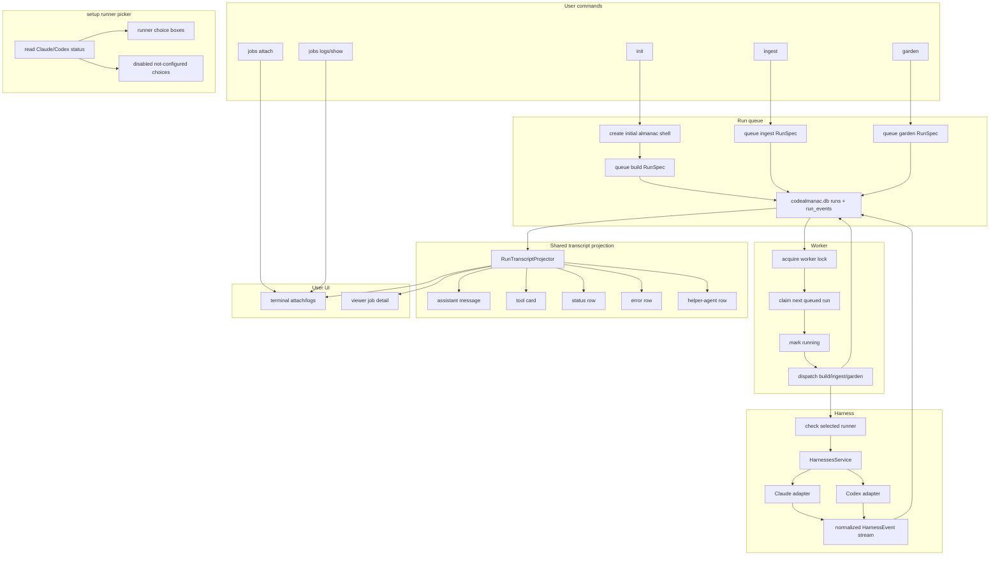

# Run Queue and Job UI Implementation Plan

> **For Claude:** REQUIRED SUB-SKILL: Use superpowers:executing-plans to implement this plan task-by-task.

**Goal:** Make `init`, `ingest`, and `garden` all create queued runs, make workers the only internal path that executes runs, stream harness output live, and render grouped job UI in both terminal and viewer.

**Architecture:** Commands create runs. Workers execute runs. `jobs` remains the user-facing command family for attach/logs/show/cancel, but internal code keeps the existing `RunRecord`, `RunSpec`, and `run_events` vocabulary. Setup shows Claude/Codex login/install status inside the runner picker itself; it does not create, block, or annotate queued runs. Harness adapters stream normalized events; a shared transcript projection turns those events into assistant messages, tool cards, status rows, and errors for terminal and viewer.

**Tech Stack:** Python, Pydantic request/models, SQLite run store, existing Claude SDK harness, existing Codex app-server harness, static ES-module viewer, pytest, ruff.

---

## Source Of Truth For This Plan

This plan replaces the scattered chat/notes discussion for the next implementation pass.

Read before implementing:

- `MANUAL.md`
- `docs/plans/2026-07-06-operation-trigger-queue-decisions.md`
- `archive/code/src/cli/commands/setup/agent-choice.ts`
- `archive/code/src/agent/readiness/view.ts`
- `archive/code/src/jobs/executor.ts`
- `archive/code/viewer/jobs-transcript.js`

Do not edit `notes.md` while implementing this plan.

## Product Words

Use these words in code, tests, and UI where possible:

- **command**: what the user runs, such as `init`, `ingest`, or `garden`
- **job**: UI word only, used in public commands like `jobs attach`
- **run**: internal durable unit of work, `RunRecord` / `RunSpec`
- **worker**: process that claims queued runs and executes them
- **harness**: product boundary for running Claude/Codex and receiving normalized events
- **runner status**: installed/logged-in/usable status for Claude or Codex
- **transcript step**: grouped UI unit derived from one or more normalized events

Avoid old abstract workflow wording in new code and docs for this work.

Code naming pressure:

- Prefer short product nouns: `run`, `queue`, `worker`, `harness`, `event`, `step`, `choice`.
- Avoid clever names and abstract architecture nouns.
- If a name needs a paragraph to explain, the boundary is probably wrong.
- Apply boundary pressure before naming files or functions: one module should own one product decision.

Implementation discipline:

- First reshape the code into the intended names and boundaries.
- Do not edit tests just to preserve old behavior while the code shape is still in motion.
- After the implementation shape is clear, update tests to encode the new behavior.
- Verification must include real commands through `uv run`, plus hands-on terminal and `codealmanac serve` checks.

## Non-Goals

- Do not add branch/HEAD safety checks.
- Do not fail runs because files outside `almanac/` changed.
- Do not preserve direct in-process `.run()` product paths for `ingest` or `garden`.
- Do not expose raw/debug event UI as the normal product.
- Do not connect setup runner status to queue creation.
- Do not rename the whole harness layer to provider.

## Current Problems

1. `init` can fail before a build run exists because `BuildWorkflow.prepare()` checks runner status before queueing.
2. `IngestWorkflow.run()` and `GardenWorkflow.run()` can create a run and execute immediately, bypassing the worker path.
3. Harness adapters consume provider streams internally, but the operation runner records harness events only after the harness returns.
4. Terminal `jobs attach` renders raw numbered run events.
5. Python viewer job detail renders raw events and dumps harness fields.
6. Setup can report runner status, but current Python setup can still write an unavailable runner into config.

## Final Architecture

### Product Flow

```text
init
  create basic almanac files
  add build run to queue

ingest
  add ingest run to queue

garden
  add garden run to queue

worker
  pick next queued run
  mark it running
  check selected runner is usable
  run Claude/Codex through harness
  record normalized events as they happen
  finish run

jobs attach
  read run events
  project them into transcript steps
  render readable blue terminal stream
```

### Mermaid View



Important: there is intentionally no arrow from `setup / doctor` to `queue build RunSpec`.

### Setup Runner Choice

This is what setup must feel like:

```text
codealmanac setup

Choose runner

  [ Codex  ready          signed in as rohan@example.com ]
  [ Claude not logged in  run: claude auth login       ]  disabled / gray

Trying to select Claude while it is not logged in:

  Claude is not logged in.
  Run `claude auth login` and then choose it again.
```

For non-interactive setup:

```text
codealmanac setup --yes

if requested/default runner is configured:
  write config
  install selected setup pieces

if requested/default runner is not configured:
  exit non-zero
  print the fix command
```

Setup answers:

```text
Can this machine run the selected Claude/Codex runner?
Is the user logged in?
What should they run if not?
```

Setup does not answer:

```text
Should init queue build?
Should ingest queue ingest?
Should garden queue garden?
```

Those commands always create runs when their normal target validation passes.

### Worker Runner Check

When a worker starts a run, it still checks the selected runner because reality may have changed since setup.

```text
worker claims build run
  check codex login status
  if unavailable:
    record readable failure event
    mark run failed
  else:
    start harness and stream events
```

This is not duplicated product policy. It is the actual execution check for a specific run.

## Target Code Shape

```python
# CLI commands only create runs.
codealmanac.commands.init.handle(args):
    repo = app.build.create_initial_shell(request)
    run = app.runs.queue_build(repo, request)
    app.workers.spawn(repo.root_path)
    render_job_started(run)

codealmanac.commands.ingest.handle(args):
    run = app.runs.queue_ingest(request)
    app.workers.spawn(request.cwd)
    render_job_started(run)

codealmanac.commands.garden.handle(args):
    run = app.runs.queue_garden(request)
    app.workers.spawn(request.cwd)
    render_job_started(run)

# Worker is the only runner.
codealmanac.runs.worker.run_queued(run):
    app.runs.mark_running(run.run_id)
    operation = app.operations.prepare(run.spec)
    app.harnesses.run(operation.harness_request, on_event=record_event)
    app.runs.finish_done_or_failed(run.run_id)

# Setup shows runner status inside the picker.
codealmanac.setup.run(request):
    choices = app.harnesses.runner_choices()
    selected = pick_enabled_runner(choices, request)
    app.config.write_runner(selected)
```

## Data Flow

```text
RunSpec
  kind: build | ingest | garden
  harness: codex | claude
  model: string
  title: string | null
  guidance: string | null
  inputs: tuple[str, ...] only for ingest
```

```text
HarnessEvent
  text_delta
  text
  tool_use
  tool_result
  tool_summary
  context_usage
  provider_session
  agent_spawned
  agent_wait_started
  agent_completed
  done
  error
```

```text
TranscriptStep
  assistant_message
  tool_card
  status_row
  error_row
  agent_row
```

Raw normalized events are persisted internally. User-facing terminal and viewer render `TranscriptStep`, not raw events.

## Rendering Rules

Bring over the best archive behavior from `archive/code/viewer/jobs-transcript.js`:

- Consecutive `text_delta` and `text` from the same actor become one assistant message.
- `tool_use` plus matching `tool_result` become one tool card.
- Tool cards infer kind, title, target, preview, status, and error state.
- Helper-agent events become readable agent/status rows.
- Errors become error rows with repair text where available.
- `tool_summary` and `context_usage` are folded into the best visible step or omitted from normal product UI.

Do not bring over archive raw/debug UI.

## Task 1: Setup Runner Picker Shows Status

**Files:**

- Modify: `src/codealmanac/services/setup/service.py`
- Modify: `src/codealmanac/services/setup/models.py`
- Modify: `src/codealmanac/cli/render/setup.py`
- Modify: `src/codealmanac/cli/dispatch/setup_tui.py`

**Steps:**

1. Add a setup runner choice model that includes:
   - harness kind
   - label
   - ready boolean
   - installed boolean if available
   - authenticated boolean if available
   - message
   - repair command
   - selected/recommended flags
2. Make interactive setup display configured and not-configured runners in the same picker.
3. Render not-configured choices as disabled/gray with the repair command visible inside the same choice box.
4. Prevent keyboard movement/selection from landing on disabled runner choices.
5. Make explicit non-interactive selection fail if the requested runner is not configured.
6. Make `setup --yes` fail rather than silently choosing an unavailable runner.
7. Keep `doctor` as a diagnostic surface for runner status.

Expected user behavior:

```text
setup shows Claude/Codex login/install status inside the runner picker.
setup does not queue or block runs.
```

## Task 2: Remove Protective Git Mutation Gate

**Files:**

- Modify: `src/codealmanac/workflows/operations/service.py`
- Modify: `src/codealmanac/workflows/build/service.py`
- Delete or retire: `src/codealmanac/workflows/operations/mutation.py`
- Modify: `src/codealmanac/integrations/harnesses/claude/adapter.py`
- Modify: `src/codealmanac/integrations/harnesses/codex/adapter.py`
- Modify: `src/codealmanac/app.py`

**Steps:**

1. Remove `OperationRunner.preflight(...)`.
2. Remove `mutation_policy.validate(...)` from operation completion.
3. Remove `ensure_tracking_available(...)` from build preparation.
4. Remove Claude/Codex adapter before/after Git snapshots if their only purpose is changed-file enforcement.
5. Keep operation prompts responsible for saying the wiki root is `almanac/`.

Expected user behavior:

```text
CodeAlmanac does not police concurrent branch edits.
The user trusts the agent prompt and reviews normal Git diff.
```

## Task 3: Make Run Queue The Only Product Execution Path

**Files:**

- Modify: `src/codealmanac/workflows/ingest/service.py`
- Modify: `src/codealmanac/workflows/garden/service.py`
- Modify: `src/codealmanac/workflows/build/service.py`
- Modify: `src/codealmanac/workflows/run_queue/service.py`
- Modify: `src/codealmanac/workflows/run_queue/worker.py`

**Steps:**

1. Remove public `IngestWorkflow.run()`.
2. Remove public `GardenWorkflow.run()`.
3. Keep worker-only execution methods, renamed to make their purpose obvious:
   - `execute_started_build(...)`
   - `execute_started_ingest(...)`
   - `execute_started_garden(...)`
4. Ensure CLI `init`, `ingest`, and `garden` only call queue/start methods that create `RunSpec` records.
5. Ensure sync queues ingest runs through the same queue path.

Expected user behavior:

```text
init always creates a build run.
ingest always creates an ingest run.
garden always creates a garden run.
Only the worker executes the run.
```

## Task 4: Split Init Shell Creation From Build Run Execution

**Files:**

- Modify: `src/codealmanac/workflows/build/service.py`
- Modify: `src/codealmanac/workflows/run_queue/service.py`
- Modify: `src/codealmanac/cli/dispatch/build.py`

**Steps:**

1. Rename or split `BuildWorkflow.prepare()` so it only performs deterministic setup:
   - resolve target
   - reject existing `almanac/`
   - register repository
   - create minimal `almanac/README.md`
   - create minimal `almanac/topics.yaml`
2. Remove runner status checks from this path.
3. Queue the build `RunSpec` after deterministic setup succeeds.
4. Preserve the product error when `almanac/` already exists.

Expected user behavior:

```text
init gives the user a job id even when Claude/Codex is currently broken.
jobs attach explains the runner failure.
```

## Task 5: Stream Harness Events Live

**Files:**

- Modify: `src/codealmanac/services/harnesses/ports.py`
- Modify: `src/codealmanac/services/harnesses/service.py`
- Modify: `src/codealmanac/integrations/harnesses/claude/client.py`
- Modify: `src/codealmanac/integrations/harnesses/claude/adapter.py`
- Modify: `src/codealmanac/integrations/harnesses/codex/app_server.py`
- Modify: `src/codealmanac/integrations/harnesses/codex/adapter.py`
- Modify: `src/codealmanac/workflows/operations/service.py`

**Steps:**

1. Add a harness event callback/sink to the harness service boundary.
2. Make Claude client call the sink as SDK messages are mapped to `HarnessEvent`.
3. Make Codex app-server client call the sink as JSON-RPC notifications are mapped.
4. Make `OperationRunner` record each emitted event immediately in `run_events`.
5. Avoid duplicate event recording after the harness returns.
6. Keep `HarnessRunResult` for terminal summary/status/transcript information.

Preferred call shape:

```python
harnesses.run(
    RunHarnessRequest(...),
    on_event=lambda event: runs.record_harness_event(run_id, event),
)
```

Expected user behavior:

```text
jobs attach shows the agent working while it is working.
```

## Task 6: Add Shared Transcript Projection

**Files:**

- Create: `src/codealmanac/services/runs/transcript.py`
- Create or modify: `src/codealmanac/services/runs/transcript_models.py`
- Modify: `src/codealmanac/services/viewer/models.py`
- Modify: `src/codealmanac/services/viewer/jobs.py`
- Modify: `src/codealmanac/cli/render/job_logs.py`

**Steps:**

1. Define transcript step models:
   - `AssistantTranscriptStep`
   - `ToolTranscriptStep`
   - `StatusTranscriptStep`
   - `ErrorTranscriptStep`
   - `AgentTranscriptStep`
2. Study the archive normalization/grouping behavior in `archive/code/viewer/jobs-transcript.js` before choosing final names.
3. Pair `tool_use` and `tool_result` by tool id.
4. Merge consecutive text events by actor.
5. Convert helper-agent events into agent/status rows.
6. Convert error/done-with-error events into error rows.
7. Fold or omit low-signal usage/summary events from normal product UI.

Expected product rule:

```text
Events are storage.
Transcript steps are UI.
```

## Task 7: Render Projected Transcript In Terminal

**Files:**

- Modify: `src/codealmanac/cli/render/job_logs.py`
- Modify: `src/codealmanac/cli/render/jobs.py`

**Steps:**

1. Change `jobs attach` to render transcript steps, not raw event rows.
2. Change `jobs logs` to render the same projected transcript as a snapshot.
3. Preserve `--json`, but make it emit transcript steps rather than raw events.
4. Use the blue CodeAlmanac visual style from the queued-run output shown to users.
5. Render assistant messages as readable text blocks.
6. Render tool cards compactly:
   - kind/icon
   - title
   - target/preview
   - status
7. Render runner-not-configured failure as an error row with repair text.

Expected terminal shape:

```text
◆ build running: run_abc123
│ repo: codealmanac
│ runner: codex

● Assistant
  I am reading the repository shape...

◇ Tool · Read
  almanac/README.md
  completed

◇ Tool · Edit
  almanac/architecture/queue.md
  completed

● Assistant
  Created the first wiki pages and topic shape.

◆ build done
  summary: build completed
```

## Task 8: Render Projected Transcript In Viewer

**Files:**

- Modify: `src/codealmanac/services/viewer/jobs.py`
- Modify: `src/codealmanac/server/assets/viewer/jobs.js`
- Modify: `src/codealmanac/server/assets/app.css`

**Steps:**

1. Add transcript steps to the job detail API response.
2. Stop dumping raw harness fields in the viewer.
3. Render assistant messages, tool cards, status rows, and errors using the same projection as terminal.
4. Keep polling active jobs.
5. Keep viewer read-only.
6. Ensure empty jobs still render a useful empty state.

Expected viewer behavior:

```text
Job page shows the job story:
  status + model + times
  assistant text
  grouped tool cards
  readable errors

It does not show raw event JSON as the main UI.
```

## Task 9: Try The Product Manually Before Editing Tests

**Files:**

- No test edits in this task.

**Steps:**

1. Run the local CLI through `uv run`, not the installed global binary.
2. Create a temp repo and run `uv run --project /Users/rohan/Desktop/Projects/codealmanac codealmanac init --guidance "write a tiny first wiki"`.
3. Attach to the returned run with `uv run --project /Users/rohan/Desktop/Projects/codealmanac codealmanac jobs attach <run-id>`.
4. Run `uv run --project /Users/rohan/Desktop/Projects/codealmanac codealmanac jobs logs <run-id>`.
5. Start `uv run --project /Users/rohan/Desktop/Projects/codealmanac codealmanac serve` and inspect the job detail page in the browser.
6. Repeat a runner-not-configured path and verify setup picker and failed run rendering are readable.
7. Note any naming/UI awkwardness and fix code before writing tests.

Expected:

```text
The product feels right before tests are rewritten around it.
```

## Task 10: Update Tests And Add Architecture Guards

**Files:**

- Modify: `tests/test_architecture.py`
- Modify: `tests/test_build_workflow.py`
- Modify: `tests/test_ingest_workflow.py`
- Modify: `tests/test_garden_workflow.py`
- Modify: `tests/test_run_queue_workflow.py`
- Modify: `tests/test_setup_service.py`
- Modify: `tests/test_cli.py`
- Modify: `tests/test_claude_adapter.py`
- Modify: `tests/test_codex_adapter.py`
- Modify: `tests/test_codex_app_server_adapter.py`
- Modify: `tests/test_viewer_api.py`
- Add: `tests/test_run_transcript_projection.py`

**Steps:**

1. Update tests only after the implementation shape and names are settled.
2. Add setup tests:
   - runner picker marks not-logged-in Claude/Codex as disabled
   - `setup --yes` fails when the selected/default runner is unavailable
   - explicit unavailable runner returns a product error with repair text
   - configured runner can be selected
3. Add tests proving runs can execute without Git mutation policing.
4. Update ingest/garden tests to queue runs and drain the worker instead of calling workflow `.run()`.
5. Add test:
   - broken harness still allows `init` to create shell and queued build run
   - worker later marks the run failed with runner-not-configured error
6. Add test that `jobs attach` can see text/tool events before final run completion.
7. Add transcript projection tests with mixed text/tool/helper/error streams.
8. Add viewer API/render tests for projected transcript steps.
9. Remove tests that preserve direct `.run()` product execution.
10. Remove tests that expect build queueing to fail before queue creation when runner is unavailable.
11. Remove tests that require mutation safety to reject outside-`almanac/` file changes.
12. Add architecture test:
    - CLI dispatch only calls queue/start methods for `init`, `ingest`, `garden`.
13. Add architecture test:
    - only worker module calls `execute_started_*`.
14. Add architecture test:
    - setup runner choice code does not import queue/run worker modules.
15. Add architecture test:
    - transcript projection sits in services/read model and is used by CLI and viewer.

## Task 11: Verification

Run:

```bash
uv run pytest
uv run ruff check .
```

Manual smoke:

```bash
tmp=$(mktemp -d)
cd "$tmp"
git init
uv run --project /Users/rohan/Desktop/Projects/codealmanac codealmanac init --guidance "write a tiny first wiki"
uv run --project /Users/rohan/Desktop/Projects/codealmanac codealmanac jobs attach <run-id>
uv run --project /Users/rohan/Desktop/Projects/codealmanac codealmanac jobs logs <run-id>
uv run --project /Users/rohan/Desktop/Projects/codealmanac codealmanac serve
```

Expected:

- `init` prints a queued build run id, shown to users as a job id.
- `jobs attach` shows grouped live output.
- If runner is not logged in, attach shows a readable failed job.
- `codealmanac serve` job page shows grouped transcript UI.
- No mutation-safety failure appears because a user edited files outside `almanac/`.

## Final Acceptance Criteria

- `init`, `ingest`, and `garden` all add runs to the same queue.
- Workers are the only normal internal path that executes build/ingest/garden runs.
- Public UI may call them jobs; internal code calls them runs.
- Setup runner picker shows not-installed/not-logged-in status inside disabled choice boxes.
- Setup runner status is not a separate queueing step.
- Runner-not-configured failure during execution is a visible failed job.
- Protective Git mutation gate is removed.
- Harness events are recorded as they happen.
- Terminal and viewer render projected transcript steps, not raw event rows.
- No raw/debug event UI is part of the product surface.
- Tests encode the new architecture instead of old bypasses.
