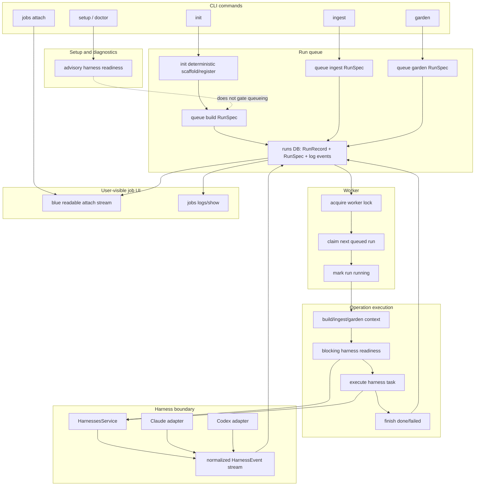

# Operation Trigger / Run Queue Audit Notes

Branch: `codex/operation-trigger-queue-audit`

Base: local `dev` at `73b764e9` after `origin/main` was merged into `dev`.

Only decision source of truth:
`docs/plans/2026-07-06-operation-trigger-queue-decisions.md`.

Treat that decision note as authoritative over old plans, docs, wiki pages,
README prose, current tests, and current implementation shape.

## Goal

Deep-audit the current CodeAlmanac codebase against the decided model:

- product nouns: trigger, run, run kind, queued run, worker, repository, local
  database, schedule,
- run kinds: `build`, `ingest`, `garden`,
- local database: `~/.codealmanac/codealmanac.db`,
- no `registry.json` fallback,
- exact-root targeting,
- read-only exact-cwd auto-registration,
- strict operation trigger targeting,
- `init` as deterministic setup plus a `build` run trigger,
- one machine-level SQLite run queue,
- worker drain semantics,
- scheduled sync/garden behavior,
- terminal output identity/result requirements,
- `--wait` as queue-then-attach shorthand,
- no foreground/background execution mode.

Primary artifact: this file. Do not edit old docs or the `almanac/` wiki during
the audit.

Default stance: notice and note discrepancies. Fix code only if the fix clearly
follows the decision note and improves code quality. Do real behavior/UX checks
before changing tests.

Code quality bar:

- Code quality is paramount.
- Names and function names should be simple.
- Refactor until diminishing returns, then stop.
- If a product decision forces ugly code, record that as product/design pressure.
- Do not preserve compatibility aliases, duplicate storage paths, root hopping,
  foreground/background thinking, or generic resolvers that hide targeting
  policy.

## Current Evidence

### Branch and version state

- Current branch is `codex/operation-trigger-queue-audit`.
- Source `pyproject.toml` version is `0.3.4`.
- Installed binary is `/Users/rohan/.local/bin/codealmanac`.
- Installed binary reports `codealmanac 0.3.1`.

Finding:
Deployed UX tests currently hit old `0.3.1`, not the merged source shape. Before
treating deployed writer behavior as current evidence, redeploy/install a current
package and record the exact version and binary.

Severity: testing blocker.

## Current Discrepancies

### 1. `--wait` is missing from job-starting commands

Decision note:

```text
`--wait` is shorthand for "create the run, then attach until it finishes."
```

Evidence:

- `src/codealmanac/cli/parser/run_commands.py` defines `init`, `ingest`, and
  `garden` flags.
- None of those parsers includes `--wait`.
- Safe source CLI checks showed:
  - `codealmanac init <path> --wait` exits 2.
  - `codealmanac ingest note.md --wait` exits 2.
  - `codealmanac garden --wait` exits 2.
  - Error is `unrecognized arguments: --wait`.

Expected:

- Command creates a normal run.
- With `--wait`, terminal attaches to that same run and streams until terminal.
- This must not become a second foreground execution mode.

Severity: must-fix product mismatch.

### 2. `jobs --help` implies a subcommand is required even though bare `jobs` works

Decision note:

```text
`codealmanac jobs` reads this machine-level queue by default.
```

Evidence:

- `src/codealmanac/cli/parser/jobs.py` uses subparsers but does not set
  `required=True`, so bare `jobs` works.
- Safe source CLI check showed bare `codealmanac jobs` prints `# 0 jobs`.
- Help renders usage as:
  `codealmanac jobs ... {show,logs,attach,cancel} ...`.

Expected:

- Help should show that listing runs is the default behavior.

Severity: UX mismatch.

### 3. `jobs attach` does not show the decided attach identity/result blocks

Decision note:

- On attach, show run kind, run id, repository, source/follow.
- On finish, show a finished/failed block with status, changed files, health, or
  logs.

Evidence:

- `src/codealmanac/cli/render/job_logs.py::render_run_attach_stream()` renders
  raw numbered events.
- Terminal completion is only `status: ...`, plus optional `summary:` or
  `error:`.
- `RunAttachUpdate` lacks repository identity, and the renderer does not resolve
  repository info.

Expected:

- Attach starts with a run identity block.
- Attach ends with the decided result block.

Severity: must-fix terminal-output mismatch.

### 4. `sync` queued-run output is not the decided run identity output

Decision note:

When a run is queued, show run kind, run id, repository, queue position/runs
ahead, and attach/follow command.

Evidence:

- `src/codealmanac/cli/render/sync.py::render_sync_status()` prints:
  `started <repo>: <run_id> (<n> transcript(s))`.
- `SyncStarted` does not carry runs-ahead or follow command data.
- `SyncIngestQueue.run()` queues runs and spawns a worker, but does not return
  the same `RunQueueStartResult` shape as manual triggers.

Expected:

- Sync-created ingest runs should surface the same queued-run identity as manual
  runs, or provide equivalent follow instructions per run.

Severity: important terminal-output mismatch.

### 5. Scheduled garden output is not the decided queued-run identity output

Evidence:

- `src/codealmanac/cli/render/run_commands.py::render_scheduled_garden()` prints
  only queued/skipped counts, run ids, skipped names, worker pid, and worker
  error.
- It does not show repository, runs-ahead, or attach/follow command per run.
- `ScheduledGardenResult` carries `runs`, `skipped`, `worker`, and
  `worker_error`, not run-identity view data.

Expected:

- Scheduled garden should not have a weaker run-output path than manual
  triggers.

Severity: important terminal-output mismatch.

### 6. `init` still performs agent/build preflight before deterministic setup

Decision note:

`init` owns deterministic setup only:

- create repository row,
- create `almanac/`,
- create minimal `README.md` and `topics.yaml`.

If deterministic setup fails, init fails. If the agent fails, the build run
fails and the repository still has its minimal wiki home.

Evidence:

- `BuildWorkflow.prepare()` calls:
  - `reject_existing_almanac(target)`,
  - `ensure_tracking_available(target.root_path)`,
  - `ensure_ready(request.harness)`,
  - then `register_target(...)`,
  - then `wiki.initialize(...)`.
- Tests encode this old behavior:
  - `test_queue_build_fails_before_queueing_when_harness_is_broken` expects no
    repository and no `almanac/`.
  - `test_run_build_rejects_non_git_repo_without_registering` expects no
    repository and no `almanac/`.

Expected:

- Minimal init setup should not depend on Codex/Claude readiness.
- The build run should own agent failure.
- After agent failure, the repo should still be registered with minimal wiki
  files.

Severity: must-fix architecture/product mismatch.

Code quality:

- `BuildWorkflow.prepare()` hides two product concepts behind one verb:
  deterministic init setup and build-run preflight.

### 7. Operation triggers can auto-register through config loading

Decision note:

Operation triggers use strict registered-root selection. Read commands may
auto-register exact cwd only.

Evidence:

- `dispatch_ingest()` and `dispatch_garden()` call `load_cli_config(...)` before
  queueing.
- `load_cli_config()` calls `ConfigService.load(...)`.
- `ConfigService.project_config_path()` calls `repositories.select_for_read(...)`.
- Safe source probe from an unregistered exact cwd with valid `almanac/` showed
  `dispatch_garden(...)` auto-registered the repo and queued a garden run.

Expected:

- Config loading for operation triggers must not mutate repository registration.
- Strict operation target selection must happen before any read convenience.

Severity: must-fix targeting mismatch.

Code quality:

- This is the generic-resolver smell the decision note warns about.

### 8. Topic and tag write commands auto-register through read selection

Evidence:

- `services/topics/repository.py::resolve_topic_repository()` always calls
  `select_for_read()`.
- Topic mutations use that helper for create/describe/link/unlink/rename/delete.
- `TaggingService` calls `PagesService.show()`.
- `PagesService.show()` uses `select_for_read()`.
- Safe source probe from an unregistered exact cwd with valid `almanac/` showed
  `topics.create(...)` auto-registered the repo and `tagging.tag(...)` rewrote
  page frontmatter.
- `tests/test_architecture.py` currently asserts `"select_for_read(" in
  repository_text`.

Expected:

- Deterministic metadata writes need an explicit targeting policy.
- If following the decision note strictly, write commands should not inherit
  read-command auto-registration.

Severity: important targeting/code-quality mismatch.

### 9. Scheduled garden can still queue missing repositories

Evidence:

- `RunQueue.start_scheduled_garden()` loops over `self.repositories.list()`.
- It skips only repositories with active garden runs.
- It does not check `repository_state(...)` for `missing_repo` or
  `missing_almanac`.
- It queues by repository name, so a stale registered repository can become a
  queued run.

Expected:

- The product needs a clear rule here.
- If the decision remains "garden all registered repositories", the failure must
  be explicit and useful.
- If user trust wins, scheduled garden should skip unavailable repositories
  before queue creation and report their state.

Severity: important reliability/UX gap.

Product pressure:

- The decision note's "garden all registered repositories" may be too simple for
  real machine state.

### 10. Worker spawn failure leaves queued runs but reports skipped work

Evidence:

- `SyncIngestQueue.run()` queues ingest runs first.
- It then calls `queue.spawn_worker(worker_cwd)`.
- If worker spawn fails, it appends transcript skipped reasons:
  `worker-spawn-failed: ...`.
- The run records remain queued in the local database.

Expected:

- Output should say "queued, but worker failed to start" with recovery/follow
  instructions, or the queued runs should be marked failed.
- Calling transcripts skipped while queued runs exist is conceptually wrong.

Severity: important UX/state mismatch.

### 11. `queued` still has two meanings

Decision note:

```text
Queued run: a run waiting to start.
```

Evidence:

- `RunStore.create()` writes status `queued` with `spec_json = NULL`.
- `RunStore.queue()` writes status `queued` with durable `RunSpec`.
- `next_queued_run()` selects only `status = queued AND spec_json IS NOT NULL`.
- `IngestWorkflow.start()` and `GardenWorkflow.start()` still call
  `RunsService.start(StartRunRequest(...))`, creating spec-less queued records
  for old inline paths.
- Tests still name one spec-less queued record `foreground`.

Expected:

- One meaning for queued worker work.
- If direct inline starts survive internally, their state should not look like
  queued worker work in run listings.

Severity: must-fix code-model smell.

### 12. `jobs`/`job` vocabulary leaks beyond the public command

Decision note:

Use simple nouns in code unless a narrower name is genuinely clearer. Avoid
`Job` when it obscures the product model.

Evidence:

- Public `codealmanac jobs` is explicitly in the decision note and can stay.
- Internal code still has:
  - `services/viewer/jobs.py`,
  - `ViewerJob*`,
  - `/api/jobs`,
  - `server/assets/viewer/jobs.js`,
  - terminal labels like `job:`,
  - `# 0 jobs`.
- Automation uses `ScheduledJob`, which may be justified by launchd vocabulary,
  but setup/UX copy also says "CodeAlmanac jobs" where "runs" may be clearer.

Expected:

- Internal product model should say runs.
- Keep "jobs" only as the public CLI surface or where scheduler vocabulary is
  genuinely narrower.

Severity: naming/code-quality debt.

### 13. Automation path derivation still bypasses `LocalStatePaths`

Decision note:

Derive machine-level paths once at the composition root as `LocalStatePaths`.
Services should receive concrete paths from that value.

Evidence:

- `LocalStatePaths` has `database_path`, `config_path`, `state_dir`, and
  `update_lock_path`, but no `logs_dir`.
- `AutomationJobFactory.job_for_task()` derives `home = request.home or
  home_dir()` and `logs_dir = logs_dir_for(home)`.
- `tests/test_architecture.py` currently asserts `"logs_dir_for(" in jobs_text`.

Expected:

- Composition root should provide local state/log paths.
- If automation needs user home for launchd plists, separate user home from
  CodeAlmanac state paths.

Severity: important composition-root/code-quality mismatch.

### 14. Runtime validation still carries retired `almanac/jobs` vocabulary

Evidence:

- `services/health/runtime.py` treats both `almanac/jobs` and `almanac/runs` as
  runtime-state leaks.
- Tests create `almanac/jobs` and expect validation to report it.

Assessment:

- This is not active queue storage.
- It is defensive cleanup for retired runtime state.
- If kept, the message/test should frame it as retired-state cleanup, not current
  model language.

Severity: low naming residue.

### 15. Tests encode old thinking

Evidence:

- Topic architecture test requires `select_for_read()`.
- Automation architecture test requires `logs_dir_for()` in job construction.
- Build tests expect broken harness/non-git to prevent minimal init setup.
- Run service tests use `StartRunRequest` to create spec-less queued records and
  name one `foreground`.
- CLI jobs tests assert `job:` output and jobs vocabulary for `RunRecord`.

Expected:

- Tests should become contracts for the decision note.
- Per audit rule, do not edit these first. Fix behavior/code shape first, then
  update tests.

Severity: important test-design debt.

## What Is Already Better After The Main Merge

- `RunKind.BUILD` exists.
- `RunSpec` accepts build specs without inputs.
- `RunQueue.queue_build()` persists build as durable queued work.
- `RunQueueWorker.run_queued()` dispatches build/ingest/garden.
- `dispatch_init()` calls `app.workflows.queue.start_build(...)`.
- Manual init now prints queued-run output instead of foreground wording.
- No `registry.json` source fallback was found.
- Exact-cwd read auto-registration does not parent-hop.
- Sync transcript matching compares transcript cwd to registered repository root
  paths, not parent roots.

Quality judgment:

- Moving build/init into the shared run queue was the right architectural move.
- The remaining work is conceptual cleanup: target selection side effects,
  ambiguous queued state, attach/result rendering, and old job vocabulary.

## Next Audit Work

- Run current installed/deployed package only after redeploying from current
  source, then record version/binary.
- Do safe source probes for:
  - nested cwd read and operation commands,
  - invalid `--wiki`,
  - missing repo and missing `almanac/`,
  - worker spawn failure output,
  - jobs show/logs/attach/cancel terminal output,
  - automation status/install output with isolated HOME where possible.
- Do not edit tests until real behavior/code shape is understood.

## 2026-07-07 safe UX probe findings, pass 2

Probe style:

- In-process CLI calls through `codealmanac.cli.main.main(...)`.
- Isolated temp database.
- Fake worker spawner for safe success paths.
- Broken worker spawner for spawn-failure path.
- No real Codex/Claude run.

### Exact-root and nested targeting are basically correct in the simple case

Evidence:

- From exact registered repo root, `search Note` returned `note`.
- From nested `repo/src`, `search Note` failed with:
  `No repository selected. Run from a registered repository root or pass --wiki <name>.`
- From nested `repo/src`, `search Note --wiki repo` returned `note`.
- From nested `repo/src`, `garden` failed with the same no-repository-selected
  message.
- From repo root, `garden --wiki missing` failed with
  `repository not found: missing`.

Assessment:

- The basic root-hopping ban works for direct command execution.
- This does not clear the config-loading auto-registration bug for unregistered
  exact cwd; that remains a separate finding.

Severity: no discrepancy found for this subcase.

### Manual worker spawn failure raw-crashes and leaves a queued run

Decision note model:

- A command always creates a run.
- Worker claims queued runs and executes them.
- Terminal output should show useful run identity and follow/log commands.

Evidence:

- Probe replaced the worker spawner with one that raises
  `OSError("fake worker spawn failed")`.
- Running `garden` raised raw `OSError('fake worker spawn failed')`; the CLI
  did not convert it to a `codealmanac:` product error because `main()` only
  catches `CodeAlmanacError` and Pydantic `ValidationError`.
- A queued garden run remained in the local DB:
  `garden-...`, kind `garden`, status `queued`.
- Source code confirms real spawner uses raw `subprocess.Popen(...)` in
  `integrations/runs/process.py`, so real spawn failures can be raw `OSError`.

Expected:

- Manual trigger should either:
  - queue the run and render "queued, but worker failed to start" with
    `jobs attach` / `jobs show` recovery instructions, or
  - mark the run failed if no worker can ever claim it.
- It must not crash with a raw Python exception after creating durable queued
  work.

Severity: must-fix failure-mode/UX mismatch.

Code quality:

- `RunQueue.start_build/start_ingest/start_garden` assume spawn success. That
  makes worker startup a hidden fatal side effect of trigger handling.
- Scheduled garden catches spawn errors, but manual triggers do not. Same concept
  has two error policies.

### `jobs show`, `jobs attach`, and `jobs cancel` confirm old output language

Evidence from terminal probe:

- `jobs show <run>` printed:
  - `job: <run-id>`
  - `kind: ingest`
  - `status: done`
  - `logs: codealmanac jobs logs <run-id>`
- `jobs logs <run>` printed numbered raw events.
- `jobs attach <run>` printed the same raw events plus:
  - `status: done`
  - `summary: done summary`
- `jobs cancel <done-run>` printed:
  - `job already done: <run-id>`

Expected:

- Public command can remain `jobs`, but renderer should describe run records as
  runs.
- Attach should render identity/result blocks from the decision note.
- Cancel output should probably say `run already done` unless the public command
  label is intentionally leaking into every record label.

Severity: important terminal-output/naming mismatch.

### Bare `jobs` list is functionally useful

Evidence:

- `jobs` listed a terminal run in a table:
  `ID KIND STATUS ELAPSED TITLE`.

Assessment:

- The default list behavior is good and matches the decision note.
- The mismatch is help text and vocabulary, not the underlying list behavior.

Severity: no functional discrepancy for bare list behavior.

## Diminishing Returns Marker

Current audit has already found the main conceptual mismatches:

- missing `--wait`,
- attach/result terminal output,
- sync/scheduled garden output,
- init deterministic setup mixed with build preflight,
- operation auto-registration through config loading,
- topic/tag write auto-registration,
- scheduled garden missing-repo behavior,
- worker spawn failure raw crash,
- spec-less queued records,
- job vocabulary leakage,
- automation path derivation outside `LocalStatePaths`,
- tests encoding old behavior.

Further useful audit should be targeted, not infinite:

- deployed current-version install/redeploy check,
- setup/automation isolated-HOME UX pass,
- real provider readiness/auth failure pass,
- one real `init --guidance "keep it tiny and finish quickly"` pass after
  deployed/source version is current.

## 2026-07-07 setup/config/automation/update audit pass

Probe style:

- Source CLI help through `uv run codealmanac ... --help`.
- Direct in-process setup service probe with:
  - isolated temp `HOME`,
  - isolated temp `CODEALMANAC` database/config paths,
  - fake scheduler,
  - fake Codex/Claude harness readiness,
  - no real launchd install,
  - no real provider run.

### `setup --target claude --yes` still configures Codex as the runner

Evidence:

- `src/codealmanac/cli/parser/setup.py` has independent `--target` and
  `--runner` flags.
- `src/codealmanac/cli/dispatch/setup_tui.py::default_setup_selections()`
  parses `--target`, but chooses `DEFAULT_HARNESS` unless `--runner` is passed.
- `DEFAULT_HARNESS` is Codex.
- Safe source probe showed:
  - `--target all --yes` -> instruction targets `codex, claude`, runner
    `codex`, model `gpt-5.5`.
  - `--target claude --yes` -> instruction target `claude`, runner `codex`,
    model `gpt-5.5`.
  - `--target claude --runner claude --yes` -> instruction target `claude`,
    runner `claude`, model `claude-sonnet-4-6`.

Expected:

- If a non-interactive user says "Claude only", the default runner should not
  silently remain Codex unless the product intentionally separates "instruction
  target" from "maintenance runner" and makes that explicit in terminal output.
- This is the exact flag-combination class of bug that can make setup look
  successful while later run creation fails on the wrong provider.

Severity: must-fix setup UX/product mismatch.

Code quality:

- `target` and `runner` are currently separate product concepts with names that
  do not explain the difference. If they remain separate, the nouns need to be
  sharper than "target" and "runner".

### `setup --yes` probes only the chosen runner even when installing both instruction targets

Evidence:

- In-process probe with fake unavailable Codex and available Claude showed:
  - instruction targets: `codex`, `claude`,
  - default runner: `codex`,
  - readiness result: `codex False codex missing in probe`,
  - both temp Codex and Claude instruction files were written.
- `SetupService.runner_readiness()` calls `self._runner_probe.readiness(
  request.harness)` for only one harness.
- It does not probe every installed instruction target.

Expected:

- If setup installs instructions for multiple agents but configures exactly one
  maintenance runner, output must make that distinction impossible to miss.
- If the chosen runner is unavailable and another installed target is available,
  the user needs a direct recovery path.

Severity: important setup failure-mode mismatch.

### Setup UI and copy still use `jobs` where the run model wants `runs`

Evidence:

- `setup --help` says `--runner` is the "agent that runs CodeAlmanac jobs".
- `runner_options()` displays "runs CodeAlmanac jobs".
- `ai_runner_step()` renders "`<model>` will run CodeAlmanac jobs".

Expected:

- Public `codealmanac jobs` can remain, because the decision note names it.
- Setup copy should describe the product model as runs, not jobs, unless it is
  specifically naming the public command.

Severity: naming/code-quality debt.

### Setup asks six interactive questions, not the earlier four-question onboarding shape

Evidence:

- `wizard_selections()` prompts:
  1. Agent instructions,
  2. AI runner,
  3. Runner model,
  4. Wiki maintenance,
  5. Product updates,
  6. Agent change handling.
- `render_setup_choice_screen()` hardcodes `[step/6]`.

Assessment:

- The operation-trigger decision note does not define setup's question count, so
  this is not a direct discrepancy from that file.
- It is still worth recording because setup is now carrying more product
  decisions than the user may expect from `--yes`, and hidden defaults directly
  affect run creation.

Severity: product-UX pressure, not a direct run-queue discrepancy.

### Setup default automation creates sync, garden, and update schedules

Evidence:

- `selected_setup_tasks()` defaults to sync, garden, and update unless disabled.
- Safe source probe showed default `setup --yes` would install tasks:
  `sync`, `garden`, `update`.
- Scheduled commands are:
  - `python -m codealmanac.cli.main sync`,
  - `python -m codealmanac.cli.main __garden-scheduler`,
  - `python -m codealmanac.cli.main update --scheduled`.

Assessment:

- This matches the broad product model: sync/garden are machine-level triggers,
  and update is machine maintenance.
- The concern is not task selection; the concern is output/readiness clarity and
  launchd environment failure handling.

Severity: no discrepancy for default scheduled task set.

### Automation path/environment construction still lives below the composition root

Evidence:

- Already noted `AutomationJobFactory.job_for_task()` calls `home_dir()` and
  `logs_dir_for(home)`.
- This pass also confirmed it builds launchd `PATH` from:
  - current process `PATH` or request `env_path`,
  - `~/.local/bin`,
  - `~/.bun/bin`,
  - hardcoded launchd fallback paths.
- `LocalStatePaths` still does not own logs path or launch environment inputs.

Expected:

- Machine state paths should come from the composition root.
- Launchd environment policy should be explicit and testable, not hidden in the
  job factory.

Severity: important composition-root/code-quality mismatch.

### `automation install` output is scheduler-centric, not run-trigger-centric

Evidence:

- `automation install --help` exposes tasks `sync`, `garden`, `update`.
- Human output from `render_automation_install()` says:
  - `automation installed`,
  - `<task> interval`,
  - `<task> command`,
  - `<task> plist`.
- It does not explain that scheduled sync and scheduled garden are machine-level
  triggers that create normal runs in the same queue.

Expected:

- The output should connect automation to the run model, especially for garden:
  "scheduled garden queues normal garden runs; follow them with
  `codealmanac jobs`".

Severity: UX clarity gap.

### `update --scheduled` active-run message still says jobs and counts ambiguous queued records

Evidence:

- `UpdatesService.run_scheduled()` calls `active_run_count(database_path)`.
- `active_run_count()` counts every run with status `queued` or `running`.
- That includes the spec-less `queued` records from the old direct-start path
  already noted in the `queued has two meanings` finding.
- `active_runs_message()` renders:
  `scheduled update skipped: <n> CodeAlmanac job(s) are active`.

Expected:

- Output should say runs.
- Active-run counting should not be distorted by the old spec-less queued state
  if that state remains temporarily.

Severity: important naming/state-model mismatch.

### `--now` is correctly absent for now

Evidence:

- Source grep found no CLI `--now` flag outside the decision note.

Assessment:

- The decision note says `--now` is a future manual trigger option.
- No current discrepancy.

Severity: no discrepancy.

### Standalone `config set` writes only user config

Evidence:

- `dispatch_config()` calls `app.config.set(...)`.
- `ConfigService.set()` writes only `local_state.config_path`.
- It does not call `select_for_read()`.

Assessment:

- Standalone `config set` does not auto-register repositories.
- The targeting bug remains in operation-trigger config loading:
  `dispatch_ingest()` and `dispatch_garden()` call `load_cli_config()`, and
  `ConfigService.load()` discovers project config through `select_for_read()`.

Severity: no new discrepancy beyond the existing operation-trigger
auto-registration finding.

## 2026-07-07 worker/sync/jobs audit pass

Probe style:

- Source inspection of worker, sync, scheduled garden, jobs, and run transition
  code.
- CLI help through `.venv/bin/python -m codealmanac.cli.main ... --help`.
- Isolated in-process worker probe with temp `HOME`, temp local database, temp
  git repo, and fake failing harness.
- No real provider run.

### Worker drain stops after the first failed run instead of moving on

Decision note:

```text
The worker claims the next queued run, executes it, records the result, and moves on.

On failure, the run is failed and removed from active queue processing.
```

Evidence:

- `RunQueueWorker.drain()` loops over `self.run_queued(queued)`.
- `BuildWorkflow.run_started()`, `IngestWorkflow.run_started()`, and
  `GardenWorkflow.run_started()` catch exceptions, call `operations.fail(...)`,
  then re-raise.
- `RunQueueWorker.run_queued()` does not catch those re-raised failures.
- Safe isolated probe queued two garden runs with a fake harness that raises.
  Result:
  - drain raised `RuntimeError fake harness failure`,
  - first run became `failed`,
  - second run stayed `queued`.

Expected:

- A failed run should be recorded as failed and the worker should continue to
  the next queued run unless the failure is a worker-level/system-level failure.
- If the product wants one failure to stop the worker, that needs to be a
  deliberate policy, because it contradicts the current decision note.

Severity: must-fix worker semantics mismatch.

Code quality:

- Operation failures and worker failures need separate control flow. Right now a
  normal run failure is still represented as an exception that aborts the whole
  drain loop.

### `__run-worker --cwd` is required but ignored after process start

Evidence:

- `SubprocessRunWorkerSpawner.spawn()` starts the child process with
  `cwd=request.cwd`.
- It also passes `__run-worker --cwd <cwd>`.
- `dispatch_run_worker()` ignores `args.cwd` and calls
  `app.workflows.queue.drain(DrainRunQueueRequest())`.
- Safe isolated CLI probe showed:
  `__run-worker --cwd /definitely/not/a/real/path` exited 0 with an empty queue.

Assessment:

- In the real spawn path, `cwd` matters because `subprocess.Popen(...,
  cwd=request.cwd)` uses it before the hidden command starts.
- The hidden CLI flag itself is dead after startup.

Expected:

- Either remove the hidden flag and rely on process cwd, or use it explicitly
  for diagnostics/worker identity.
- A required hidden flag that does nothing teaches the wrong model to future
  maintainers.

Severity: code-quality/diagnostic mismatch.

### `__run-worker` is silent for lock-not-acquired and no-work cases

Evidence:

- `dispatch_run_worker()` discards the `RunQueueDrainResult`.
- `RunQueueWorker.drain()` returns `RunQueueDrainResult(lock_acquired=False)`
  when another worker lock is active.
- The hidden CLI has no `--json` output and no human output.

Expected:

- Hidden launchd commands can be quiet on success, but lock contention and
  worker diagnostics need some observable trail when debugging scheduled runs.
- If the command remains intentionally silent, `doctor` or `automation status`
  needs to expose enough worker/queue state to explain why queued runs are not
  moving.

Severity: failure-mode/diagnostic gap.

### `sync --help` implies `status` is required even though bare `sync` is the trigger

Evidence:

- `src/codealmanac/cli/parser/run_commands.py` creates `sync_subcommands` but
  does not make it required.
- Bare `sync` is the actual operation trigger.
- Help renders usage as:
  `codealmanac sync ... {status} ...`.

Expected:

- Help should make it clear that bare `sync` starts the scheduled-sync-style
  trigger manually, and `sync status` is optional inspection.

Severity: UX mismatch.

### Sync advances `last_completed_at` even when worker spawn fails

Evidence:

- `SyncIngestQueue.run()` queues ingest runs, then calls `queue.spawn_worker()`.
- If spawn fails, it appends `worker-spawn-failed: ...` skipped reasons.
- It still calls `self.state_store.record_completed(now)` after the spawn
  failure handling.
- The queued runs remain in the database.

Expected:

- Sync state should not advance past transcripts merely because runs were queued
  if the worker did not start and no run processed them.
- At minimum, terminal output should say the transcripts are queued but not yet
  processed, instead of mixing "started" and transcript-level skipped reasons.

Severity: must-fix sync state/worker failure mismatch.

Code quality:

- Queue creation, worker startup, and sync watermark advancement are three
  different product facts. The current method compresses them into one
  "completed" side effect.

### Cancelling a running run does not stop the worker or provider

Evidence:

- `jobs cancel` help says "cancel one queued or running job".
- `RunsService.cancel()` only changes the run record state.
- No code path signals the worker process or harness process.
- `finish_run()` preserves a `cancelled` record, so a later finish call does not
  overwrite the status, but the agent may already have continued mutating files.

Expected:

- If cancellation is only "mark this run cancelled and ignore final status",
  help/output should not imply the running provider is stopped.
- If users expect cancellation to stop work, the worker/harness layer needs a
  real cancellation mechanism.

Severity: important UX/failure-mode mismatch.

### Job vocabulary still dominates jobs help and subcommand copy

Evidence:

- `jobs --help` says "inspect local jobs".
- Subcommands say "show one job record", "show one job log", "stream one job
  log until the job exits", and "cancel one queued or running job".
- Renderers still print `# 0 jobs`, `job:`, and `job already ...`.

Expected:

- Public command may remain `jobs`.
- The record being inspected should be called a run.

Severity: naming/code-quality debt.

### Scheduled garden has no JSON output path

Evidence:

- Hidden `__garden-scheduler` parser has no `--json`.
- `dispatch_scheduled_garden()` always calls `render_scheduled_garden(result)`.
- `render_scheduled_garden()` prints human-only scheduler output.

Assessment:

- This is hidden automation, so lack of JSON may be acceptable.
- It still means scheduled-garden diagnostics are weaker than manual trigger
  diagnostics and cannot easily be consumed by tests or support scripts.

Severity: low-to-important diagnostic gap.

### Sync exact-root transcript matching is aligned

Evidence:

- `SyncEvaluator.evaluate()` builds `repositories_by_path` from registered
  repository root paths.
- It matches transcripts by exact normalized `transcript.cwd`.
- It records `unregistered-cwd` when the transcript cwd does not exactly match.

Assessment:

- This matches the decision note's "scheduled sync must not root-hop" rule.

Severity: no discrepancy.

## 2026-07-07 read/organization targeting audit pass

Probe style:

- Source inspection of wiki/read parsers, dispatch, services, and renderers.
- CLI help through `.venv/bin/python -m codealmanac.cli.main ... --help`.
- Isolated CLI probe with temp `HOME`, temp local database/config, temp repo,
  and hand-written `almanac/`.
- No real provider run.

### Read commands auto-register exact cwd and reject nested cwd as expected

Evidence:

- `SearchService.search()` and `PagesService.show()` use
  `repositories.select_for_read(...)`.
- Safe isolated probe:
  - `codealmanac list --json` from an unregistered repo with valid `almanac/`
    returned `[]`.
  - `codealmanac search hello --json` from that exact repo root returned the
    page and auto-registered the repo.
  - `codealmanac list --json` then showed the repo as registered and available.
  - `codealmanac search hello` from `repo/src` failed with:
    `No repository selected. Run from a registered repository root or pass
    --wiki <name>.`

Assessment:

- This matches the decision note for read-only exact-cwd auto-registration and
  no parent root hopping.

Severity: no discrepancy.

### `topics --help` implies a subcommand is required even though bare `topics` lists topics

Evidence:

- `src/codealmanac/cli/parser/wiki.py` creates `topic_subcommands` but does not
  make it required.
- `dispatch_topic_rewrite()` falls through to `app.topics.list(...)` when no
  topic subcommand is present.
- Help renders usage as:
  `codealmanac topics ... {show,create,describe,link,unlink,rename,delete} ...`.

Expected:

- Help should show that bare `topics` lists topics, just like bare `jobs` lists
  runs and bare `sync` triggers sync.

Severity: UX mismatch.

### Topic service has no read-vs-write repository selection boundary

Evidence:

- `services/topics/repository.py::resolve_topic_repository()` always calls
  `select_for_read()`.
- Topic reads (`list`, `show`) and topic writes (`create`, `describe`, `link`,
  `unlink`, `rename`, `delete`) all use that helper.
- This is the same root cause behind the earlier finding that topic mutations
  can auto-register an exact cwd with `almanac/`.

Expected:

- Topic reads can use the read-selection policy.
- Topic writes need an explicit deterministic-write policy; they should not
  inherit read auto-registration accidentally.

Severity: important targeting/code-quality mismatch.

Code quality:

- A helper named `resolve_topic_repository` hides the product decision. It should
  be obvious at the call site whether a command is using read selection or
  strict/write selection.

### `tag`/`untag` still mutate through `PagesService.show()`

Evidence:

- `TaggingService.tag()` and `TaggingService.untag()` call `PagesService.show()`.
- `PagesService.show()` uses `select_for_read()`.
- The command then rewrites page frontmatter through `rewrite_page_topics(...)`.

Expected:

- Tagging is a write command and should not depend on a read command's
  auto-registration convenience.

Severity: important targeting/code-quality mismatch.

### `topics`, `tag`, and `untag` have no JSON output path

Evidence:

- `topics --help` exposes only `--wiki`, no `--json`.
- `tag --help` exposes only `--wiki`, no `--json`.
- `untag` follows the same parser shape as `tag`.
- Renderers print human-only text from `render_topics`,
  `render_topic_mutation`, `render_topic_rewrite_mutation`, and
  `render_tagging`.

Expected:

- If these remain user-facing organization commands, JSON parity should be
  considered with the rest of the read/inspect surface.
- If JSON is not needed, document that these are human-only mutation helpers.

Severity: low-to-important output consistency gap.

### Viewer/serve can fall back to the first available registered repository

Evidence:

- `serve` creates the server with `create_server_app(app, Path.cwd(), args.wiki)`.
- Viewer API calls use `ViewerRepositoryScope.select(...)`.
- If no `--wiki` is provided and `select_for_read(cwd, None)` raises
  `NotFoundError`, `ViewerRepositoryScope.select_default()` returns the first
  available registered repository.

Assessment:

- This is not an operation trigger, so it does not directly violate the strict
  operation-targeting rule.
- It does violate the general "exact cwd or --wiki" mental model if a user runs
  `serve` from an unrelated directory and silently sees some other registered
  repo.

Expected:

- Decide whether viewer convenience is allowed to break exact-cwd targeting.
- If allowed, terminal output should say which repository was selected and why.

Severity: product-UX targeting pressure.

### `validate` and `reindex` use read selection while writing derived state

Evidence:

- `HealthService.validate()` uses `select_for_read()`.
- `IndexService.reindex()` uses `select_for_read()`.
- Both commands can refresh/rebuild derived index state in the local database.

Assessment:

- These commands do not write page prose or committed wiki source.
- They are probably acceptable under the decision note's "read commands may
  refresh derived local index state" rule.
- Still, they are not purely read-only, so their auto-registration behavior
  should be intentional and documented in tests.

Severity: no direct discrepancy; test/contract clarity gap.

### `show --json` ignores projection flags by returning the full page view

Evidence:

- `render_page()` returns full `PageView` immediately when `args.json` is true.
- It does not apply `--body`, `--meta`, `--lead`, `--links`, `--backlinks`,
  `--files`, or `--topics` projections in JSON mode.

Assessment:

- This is not directly covered by the operation-trigger decision note.
- It is a JSON/human output inconsistency worth remembering while cleaning the
  command surface.

Severity: low output consistency gap.

## 2026-07-07 deployed/source version smoke

Probe style:

- Read installed binary path and version.
- Read source package version.
- Run current source as a uv tool without replacing the global install:
  `uv tool run --from /Users/rohan/Desktop/Projects/codealmanac codealmanac ...`.
- Do not mutate global `codealmanac` install.

### Global installed product is still old

Evidence:

- `which codealmanac` -> `/Users/rohan/.local/bin/codealmanac`.
- `/Users/rohan/.local/bin/codealmanac` is a uv tool shim into
  `/Users/rohan/.local/share/uv/tools/codealmanac/bin/python3`.
- `uv tool list` reports `codealmanac v0.3.1`.
- `codealmanac --version` reports `codealmanac 0.3.1`.
- `pyproject.toml` in the current source says `version = "0.3.4"`.

Expected:

- Do not treat global CLI smoke as current-code evidence until the tool is
  upgraded or intentionally run through a current-source tool command.

Severity: testing blocker for deployed-product claims.

### Current-source uv tool smoke works without replacing the global tool

Evidence:

- `uv tool run --from /Users/rohan/Desktop/Projects/codealmanac codealmanac
  --version` built the local source and reported `codealmanac 0.3.4`.
- After that smoke, plain `codealmanac --version` still reported
  `codealmanac 0.3.1`, so the global install was not replaced.

Assessment:

- For current-code UX checks that should look like an installed CLI, prefer
  `uv tool run --from <repo> codealmanac ...` over the broken local `.venv`
  command and over mutating the user-level global tool.

Severity: useful audit/testing path.

### Current-source `0.3.4` smoke confirms parser discrepancies

Evidence from `uv tool run --from ...`:

- `codealmanac init --help` in current source has no `--wait`.
- `codealmanac jobs --help` still renders subcommands as if one is required and
  still says "job" in help copy.
- `codealmanac sync --help` still renders `{status}` as if status is required
  even though bare `sync` is the trigger.

Assessment:

- These are not artifacts of the stale global `0.3.1` binary.
- They exist in the current `0.3.4` source package shape.

Severity: confirms existing findings.

### Local `.venv` command is not good version evidence

Evidence:

- `.venv/bin/python -m codealmanac.cli.main --version` reports
  `codealmanac 0+unknown`.
- Earlier `uv run codealmanac ...` commands repeatedly warned about missing
  `RECORD` files for stale `codealmanac-0.1.2.dist-info` and
  `codealmanac-0.3.4.dist-info`.

Expected:

- Do not use `.venv` version output as deployed-version evidence.
- Use source inspection, `pyproject.toml`, and `uv tool run --from` for
  current-source smoke.

Severity: test-environment hygiene gap.

## Diminishing returns status

Source-level audit is now near diminishing returns.

Covered at least once:

- init/build queue shape,
- manual ingest/garden triggers,
- sync and scheduled garden,
- worker drain and worker spawn failure,
- jobs list/show/logs/attach/cancel,
- setup `--yes`, runner/target selection, automation install,
- config/update/doctor basics,
- read commands and organization writes,
- JSON/human output mismatches,
- deployed/source version mismatch.

Remaining high-value work is no longer more source reading. It is real smoke:

- upgrade or explicitly run current-source CLI for any deployed-product claim,
- real `init` writer run with `--guidance` asking the agent to return early,
- missing/broken provider binary and bad-auth behavior with real Codex/Claude
  adapters,
- launchd/PATH behavior from an actual scheduled job.

Do not keep expanding source audit unless a new concrete question appears.

## 2026-07-07 real current-source provider-readiness smoke

Probe style:

- Current source only:
  `uv tool run --from /Users/rohan/Desktop/Projects/codealmanac codealmanac ...`.
- Temp `HOME`.
- Temp `CODEALMANAC_DATABASE_PATH` and `CODEALMANAC_CONFIG_PATH`.
- Temp git repo.
- No real user wiki or global install mutation.
- `init` used guidance:
  `Smoke test only. Return early, keep it tiny, do not spend time polishing.`

### Real current-source `init` fails before deterministic setup when Codex is unavailable

Evidence:

- Command:
  `codealmanac init <temp-repo> --guidance "Smoke test only. Return early, keep
  it tiny, do not spend time polishing." --json`
- Current-source version in the smoke was `codealmanac 0.3.4`.
- Temp repo was a valid git repo.
- Temp HOME caused Codex readiness to fail with:
  `harness codex is not available: WARNING: proceeding, even though we could not
  create PATH aliases: Refusing to create helper binaries under temporary dir ...
  -- ... or sign in with codex login; or switch harness: codealmanac config set
  harness.default claude`.
- Exit code was `1`.
- After failure:
  - `almanac/` did not exist,
  - `almanac/README.md` did not exist,
  - `codealmanac list --json` returned `[]`,
  - `codealmanac jobs --json` returned `[]`.

Expected:

- Per the decision note, `init` should perform deterministic setup first:
  repository row, `almanac/`, minimal `README.md`, and `topics.yaml`.
- Provider failure should become a failed `build` run, not prevent minimal setup
  and queue creation.

Severity: confirms the must-fix init/build discrepancy with real current-source
behavior.

### `doctor` does not report provider readiness

Evidence:

- In the same isolated temp HOME where Codex readiness failed, `doctor --json`
  exited `0`.
- It reported:
  - version,
  - Python,
  - database path,
  - manual package,
  - wiki selection status.
- It did not report Codex/Claude readiness.

Expected:

- If `init` can fail before deterministic setup because a provider is
  unavailable, `doctor` should expose provider readiness or setup should be the
  explicit readiness command.

Severity: important diagnostics gap.

### `setup --yes` records unavailable runner but still exits 0 and writes Codex config

Evidence:

- Command:
  `codealmanac setup --yes --skip-instructions --no-auto-update --sync-off
  --garden-off --json`
- Exit code was `0`.
- JSON wrote config values:
  - `auto_commit = true`,
  - `harness.default = codex`,
  - `harness.model = gpt-5.5`.
- JSON also reported:
  - `runner_readiness.kind = codex`,
  - `runner_readiness.available = false`,
  - repair text suggesting `codex --version`, `codex login`, or switching to
    Claude.

Assessment:

- This is useful structured output, but it still leaves the machine configured
  to use an unavailable default runner.
- Combined with `init` failing before deterministic setup, this makes the happy
  path brittle for users who run `setup --yes` in an environment where Codex is
  not actually ready.

Expected:

- Either `setup --yes` should fail when the chosen runner is unavailable, or it
  should configure a ready runner when one exists, or it should make the
  unavailable state impossible to miss in human output and next steps.

Severity: important setup/provider-readiness mismatch.

### `uv tool run --from` with temp HOME has noisy cold-start stderr

Evidence:

- First current-source smoke under temp HOME downloaded Python and dependencies.
- stderr included many `WARN Skipping file ...` package-index messages before
  the CodeAlmanac command output.

Assessment:

- This is uv/tooling noise, not CodeAlmanac product output.
- It does mean current-source smoke through `uv tool run --from` is good for
  audit evidence but noisy for polished UX screenshots.

Severity: test-harness note, not a product discrepancy.

## Final audit stopping point

At this point, the audit has crossed into diminishing returns for this branch.

Concrete source and behavior evidence now covers the requested command families:

- job-starting commands: `init`, `ingest`, `garden`,
- queue inspection/control: `jobs`, `jobs show`, `jobs logs`, `jobs attach`,
  `jobs cancel`,
- worker internals: `__run-worker`,
- scheduled triggers: `sync`, `sync status`, `__garden-scheduler`,
- machine setup/configuration: `setup`, `automation`, `config`, `doctor`,
  `update`,
- read/organization commands: `search`, `show`, `topics`, `tag`, `untag`,
  `health`, `validate`, `reindex`, `serve`,
- deployed/current-source version mismatch,
- real provider-readiness smoke with current source.

Do not continue broad audit without a new concrete question. The next useful
work should be deciding fixes and implementation order from these findings, not
finding one more variant of the same mismatch.

## Follow-up: attached jobs must stream normalized harness events

The user clarified the queue decision: the important part is not merely that a
run is attached to `jobs`. The attached view must stream readable agent output
as it happens.

Expected behavior:

- `init` creates deterministic wiki scaffolding, registers the repo, queues a
  build run, and then the build command path takes over.
- `build`, `ingest`, and `garden` should be equivalent job operations at
  the run/job layer: queued background run, attachable job id, same prompt/manual
  machinery, same operation runner, same readable attached stream, same final
  success/failure semantics.
- `build` may do build-specific minimal scaffolding, `ingest` may resolve source
  inputs, and `garden` may inspect index/health context. Those are payload
  differences, not different job semantics.
- `jobs attach <run_id>` should render normalized harness events continuously:
  assistant text deltas, tool starts/results, tool summaries, helper-agent
  events, provider session, usage, done/error.
- The attached stream should use the same blue CodeAlmanac visual language as
  the queued-run output, but the stream body should be easy to read rather than
  raw numbered log rows.

Archived normalized event model:

- `archive/code/src/harness/events.ts` defined one provider-neutral
  `HarnessEvent` union with `text_delta`, `text`, `tool_use`, `tool_result`,
  `tool_summary`, `context_usage`, `provider_session`, `error`, `done`,
  `agent_spawned`, `agent_wait_started`, and `agent_completed`.
- Tool events carried a normalized display object: kind, title, path, command,
  cwd, status, exit code, duration, summary, provider thread/turn ids.
- Actor fields made root/helper-agent events distinguishable without exposing
  provider-specific raw payloads as the primary UI contract.

Current Python status:

- `src/codealmanac/services/harnesses/events.py` already mirrors the archived
  normalized event model closely.
- Claude and Codex adapters both consume streaming provider messages internally:
  `src/codealmanac/integrations/harnesses/claude/client.py` iterates the Claude
  stream, and `src/codealmanac/integrations/harnesses/codex/app_server.py` reads
  Codex JSON-RPC notifications.
- The adapter contract in `src/codealmanac/services/harnesses/ports.py` still
  returns one completed `HarnessRunResult`.
- `OperationRunner.execute()` records harness events only after
  `self.harnesses.run(...)` returns.
- `RunAttachStreamer` polls persisted run events, so `jobs attach` can only show
  events after they are written to the run log.
- Therefore the current code has the right normalized event vocabulary but does
  not yet stream provider output live through attached jobs.

Current build/ingest/garden equivalence:

- They are equivalent after a run is started: all render prompts from
  `BASE_KERNEL` plus an operation prompt, include manual inventory, and execute
  through `OperationRunner.execute()`.
- The queue layer supports all three through durable `RunSpec` values and the
  run worker dispatches `BUILD`, `INGEST`, and `GARDEN`.
- They are not equivalent before queue/start:
  `BuildWorkflow.prepare()` performs mutation tracking and harness readiness
  before the queued build run exists, while ingest/garden defer provider failure
  into the run path.
- This explains the confusing init behavior observed in smoke testing: current
  `init` can fail before scaffolding/registering/queueing when the harness is
  unavailable, but the intended model is deterministic init scaffolding followed
  by an attachable build run whose failure is visible through jobs.

Implementation implication:

- Keep the normalized `HarnessEvent` model.
- Change the harness/run boundary so providers can emit normalized events via a
  callback or iterator while the run is active.
- Record each emitted event immediately into the run log, then have
  `jobs attach` render those events with the polished blue stream UI.
- Move build harness readiness out of pre-queue `prepare()` and into the started
  build run path, so init/build/ingest/garden share job semantics.

## Follow-up: queue boundary and readiness placement

The user clarified the product requirement again: `init` should become build,
and `build`, `ingest`, and `garden` should be equivalent queue-backed commands.
They should not have hidden pre-command differences that change
whether a run exists, whether a worker is assigned, or whether `jobs attach`
can explain the failure.

Readiness placement:

- Readiness should exist as an independent capability for `setup`, `doctor`,
  and human guidance.
- Blocking readiness for a queued job should happen after the worker
  has claimed a queued run and after the run is marked `running`.
- If readiness fails, the failure should be a run event and terminal failed run,
  visible through `jobs show`, `jobs logs`, and `jobs attach`.
- Readiness should not prevent `init` from creating deterministic scaffolding,
  registering the repo, creating the queued run row, or printing the attach
  command.

Current code status:

- The normal CLI paths for `init`, `ingest`, and `garden` all go through
  `app.workflows.queue.start_*`.
- `sync` queues ingest runs through `SyncIngestQueue`, then spawns a worker.
- The queue worker drains durable `RunSpec` records and dispatches `BUILD`,
  `INGEST`, and `GARDEN`.
- `RunStore.queue()` creates a durable queued run with `spec_json`.
- `RunQueueWorker.run_queued()` marks the queued run running through
  `OperationRunner.begin()`.

Queue bypass surfaces:

- `IngestWorkflow.run()` still creates a run with `RunsService.start()` and
  immediately calls `run_started()` in-process.
- `GardenWorkflow.run()` has the same direct synchronous path.
- Those direct paths create queued-looking runs without durable `RunSpec` and
  bypass worker assignment.
- Tests still rely on the direct paths:
  `tests/test_ingest_workflow.py` and `tests/test_garden_workflow.py` call
  `app.workflows.ingest.run(...)` / `app.workflows.garden.run(...)`.
- `BuildWorkflow` does not expose the same direct `run()` path, so the three
  commands are not internally symmetrical.

Build-specific pre-queue mismatch:

- `RunQueue.queue_build()` calls `BuildWorkflow.prepare()`.
- `BuildWorkflow.prepare()` rejects an existing `almanac/`, checks harness
  readiness, registers the repository, and initializes the wiki before the
  queued run exists.
- `tests/test_build_workflow.py::test_queue_build_fails_before_queueing_when_harness_is_broken`
  explicitly preserves this old behavior.
- That test conflicts with the clarified job requirement.

Archived behavior:

- Archive setup checked agent readiness during setup/doctor/default-agent
  selection, so readiness was still visible before normal operations.
- Archive jobs accepted an operation spec, wrote a queued job record and log,
  spawned a worker, claimed the queued job, and passed an `onEvent` hook into the
  harness execution path.
- Archive job execution wrote harness events as they happened through the job
  event logger.
- This is closer to the desired model than current Python: readiness guidance
  exists outside jobs, while command failure belongs inside the job.

Target architecture:

- Public command entry points should queue only:
  `start_build`, `start_ingest`, `start_garden`.
- Direct synchronous workflow `.run()` methods should either be removed,
  made test-only private helpers, or converted to queue-and-drain helpers whose
  name makes the bypass explicit.
- There should be one durable run path:
  queued row with `RunSpec` -> worker lock -> claim next queued -> mark running
  -> harness readiness -> live harness event recording -> terminal status.
- Build-specific deterministic setup should be split from agent readiness:
  register/scaffold/queue first; readiness failure belongs to the queued build
  run.

## Concrete chat agreements: command queue and harness architecture

These are the concrete agreements from the follow-up discussion.

### Product command agreement

- The user-facing commands are `init`, `ingest`, and `garden`.
- `init` is the user-facing command that creates the deterministic local wiki
  shell and then queues a `build` run.
- `build`, `ingest`, and `garden` are equivalent run kinds once they enter the
  queue.
- The equivalence means: same run table, same queue, same worker claim path,
  same attach/logs surface, same harness event streaming surface, and same
  terminal success/failure semantics.
- Their payloads differ:
  - build receives new-wiki context and optional guidance,
  - ingest receives source refs and source runtime context,
  - garden receives existing wiki/index/health context.
- Those payload differences must not create different job behavior.

### Queue agreement

- There should be one normal way to run build/ingest/garden work: add a durable
  `RunSpec` job to the queue.
- Public command APIs should queue work, not execute it synchronously.
- `IngestWorkflow.run()` and `GardenWorkflow.run()` are bypass-shaped product
  paths and should be removed, made private test helpers, or converted to
  queue-and-drain helpers with explicit names.
- `run_started(...)` / `execute_started(...)` can remain as worker-internal
  methods only.
- A run should move:
  queued -> claimed by worker -> running -> done/failed/cancelled.
- Only a running run should become done or failed.
- A queued run without a durable `RunSpec` is not a valid job.

### Readiness agreement

- Readiness is still a real capability.
- `setup` and `doctor` should check readiness and explain what is ready or
  broken.
- That setup/doctor readiness is advisory and diagnostic.
- Blocking readiness for `build`, `ingest`, and `garden` belongs inside the
  running job, after the worker has claimed the queued run.
- Readiness failure should produce run log events and a failed run that
  `jobs attach`, `jobs logs`, and `jobs show` can explain.
- Readiness should not prevent `init` from creating deterministic scaffolding,
  registering the repo, queueing the build run, or printing the attach command.

### Init/build agreement

- `init` should do deterministic setup first:
  - resolve target repo,
  - reject invalid target shape,
  - register repo,
  - create minimal `almanac/` scaffold.
- Then `init` queues a build run.
- Build-specific harness readiness must not happen before the queued run exists.
- The current `BuildWorkflow.prepare()` mixes deterministic setup with harness
  readiness; that boundary should be split.

### Streaming agreement

- Attached jobs must stream normalized harness events as they happen.
- The event vocabulary should stay provider-neutral:
  `text_delta`, `text`, `tool_use`, `tool_result`, `tool_summary`,
  `context_usage`, `provider_session`, `agent_spawned`,
  `agent_wait_started`, `agent_completed`, `done`, and `error`.
- Harness adapters may understand Claude/Codex-specific protocols, but the run
  log and attach renderer should consume normalized `HarnessEvent` values.
- The current Python event model is close to the archived model.
- The current weakness is that adapters return a completed `HarnessRunResult`,
  and `OperationRunner.execute()` records events after completion.
- The target is live event emission: adapter emits normalized events during
  execution -> operation runner records each event immediately -> `jobs attach`
  renders a readable blue CodeAlmanac stream.

### Harness boundary agreement

- Keep the distinction between:
  - queued jobs,
  - harness service / harness event contract,
  - provider-specific Claude/Codex adapters,
  - setup/doctor readiness.
- Do not leak Claude SDK, Codex app-server, Codex CLI, or provider-specific
  protocol details into workflows or run services.
- Do not rename everything to provider. The harness boundary remains the
  product execution boundary; adapters hide provider details.

### Final target architecture



### Simplest rule

Commands create jobs. Workers run jobs. Readiness fails inside jobs. Harness
adapters stream normalized events. Attach explains everything.

## Follow-up: remove protective Git gate and define render projection

The user asked to remove the overprotective mutation safety gate entirely.

### Remove mutation safety gate

Agreement:

- Do not block jobs by snapshotting Git before/after the agent writes.
- Do not fail jobs because files outside `almanac/` changed.
- Do not add branch/HEAD safety checks.
- Do not treat user branch switching or concurrent user edits as a CodeAlmanac
  job failure.
- Trust the prompt and the model: build/ingest/garden agents should be guided to
  write only inside `almanac/`.
- If something unexpected changes, the user can inspect the normal Git diff.

Current code to remove or simplify when implementing:

- `src/codealmanac/workflows/operations/mutation.py`
- `OperationRunner.preflight(...)` calls and event wording in
  `src/codealmanac/workflows/operations/service.py`
- `mutation_policy.validate(...)` calls after harness execution.
- `ensure_tracking_available(...)` in `BuildWorkflow.prepare()`.
- Claude/Codex adapter Git before/after snapshots whose only purpose is
  enforcing changed-file safety.

Replacement rule:

- Jobs run the selected harness in the repo with clear instructions about the
  allowed wiki root.
- Job success/failure comes from runner availability, harness result, prompt
  result, and normal operation errors, not protective Git policing.

### Concrete meaning: runner readiness

Use "runner readiness" for the selected Claude/Codex harness being locally
usable.

Runner readiness means:

- Is the selected runner installed?
- Is it authenticated?
- Can its status command return within the timeout?
- If not, what repair command should the user run?

Current code:

- `src/codealmanac/services/harnesses/service.py`
  - `HarnessesService.readiness(...)` returns readiness info.
  - `HarnessesService.ensure_ready(...)` raises when unavailable.
  - `HarnessesService.run(...)` currently calls `ensure_ready(...)` before
    adapter execution.
- `src/codealmanac/integrations/harnesses/claude/adapter.py`
  - `ClaudeSdkHarnessAdapter.check()` runs `claude auth status` and falls back
    to `ANTHROPIC_API_KEY`.
- `src/codealmanac/integrations/harnesses/codex/adapter.py`
  - `CodexAppServerHarnessAdapter.check()` runs `codex login status`.
- `src/codealmanac/services/setup/service.py`
  - `SetupService.runner_readiness(...)` reports readiness through setup.

Architecture note:

- `setup` and `doctor` may show runner readiness as guidance.
- Job queueing should not be blocked by runner readiness.
- The running job should perform blocking readiness, record the result, and fail
  visibly if the runner is unavailable.

### Render agreement: raw events are not UI

The user clarified that terminal attach and Python viewer jobs should be
inspired by the archived viewer, not by raw event streaming.

Agreement:

- Persist normalized harness events.
- Do not render them one-for-one as the primary UI.
- Project raw events into readable transcript steps first.
- Use that projection for both terminal `jobs attach` and viewer job details.

Archived behavior to preserve:

- `archive/code/viewer/jobs-transcript.js` converts normalized events into
  transcript steps.
- Consecutive `text_delta` / `text` events from the same actor become one
  assistant bubble.
- `done.result` can be folded into the assistant bubble when it is the final
  assistant text.
- `tool_use` and matching `tool_result` become one tool card.
- Tool cards infer kind, icon, title, target, preview, status, and error state.
- `tool_summary` and `context_usage` are hidden in normal mode and shown in
  debug mode.
- helper-agent events become agent/status transcript rows.
- errors become error status rows with repair detail where available.

Archived projection support:

- `archive/code/src/jobs/projections/log-events.ts` parses wrapped job log
  events and preserves sequence/timestamp/actor metadata.
- `archive/code/src/jobs/projections/view.ts` derives display title, subtitle,
  helper-agent traces, and job warnings.
- `archive/code/viewer/jobs-view.js` renders the projected transcript, not raw
  event JSON.

Current Python gap:

- `src/codealmanac/cli/render/job_logs.py` prints raw numbered log rows.
- `src/codealmanac/services/viewer/jobs.py` exposes raw run events.
- `src/codealmanac/server/assets/viewer/jobs.js` renders event rows and dumps
  harness fields.
- There is no shared Python projection layer that turns `RunLogEvent` +
  `HarnessEvent` into assistant bubbles, tool cards, status rows, warnings, and
  agent traces.

Target render architecture:

- Add a run transcript projection in Python services, near the run/job read
  model rather than inside terminal or browser UI.
- The projection should output stable UI-neutral transcript steps:
  assistant message, tool card, status row, error row, agent row.
- Terminal attach should render these projected steps in the blue CodeAlmanac
  style.
- Viewer jobs should render the same projected steps in HTML.

### Revision: no raw/debug product surface

The user clarified that the product does not need a raw/debug event surface.

Revised target:

- Raw normalized events remain an internal persisted log format.
- The user-facing terminal and viewer should show the actual projected transcript
  only.
- Do not bring over archive's debug/raw event UI as product behavior.
- Bring over the best part of archive: grouping raw events into readable
  assistant bubbles, tool cards, status rows, and error rows.
- Treat archive's older product vocabulary and raw-event-first surfaces as
  retired thinking.
